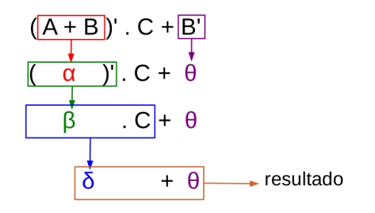
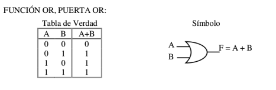

# Arquitectura de Computadoras

## Grupo de trabajo

- Adjunto: Claudio Omar Biale (Teoría y lógica digital)
- Jefe de Trabajos Prácticos: Roberto Anibal Miño (Lógica digital)
- Ayudante de Primera: Viviana María Arenhardt (Ensamblador usando RISC-V)
- Ayudante de Segunda: Melissa Kolb (Ensamblador usando RISC-V)

## Libro de Referencia

El libro de referencia es: **Computer Organization and Design: The Hardware/Software Interface, RISC-V edition** de *Hennessy* y *Patterson*.

El cuerpo principal del libro asume que han tenido un curso completo de diseño lógico. **:)**

No es nuestro caso, por ello comenzaremos con el apéndice A, que realiza una revisión sobre diseño lógico o lógica digital.


## Consideraciones

Las presentaciones o apuntes no reemplazan a la bibliografía de la asignatura.

## Lógica digital

**Tarea *(Por si no realizaron la tarea solicitada previamente)***: deben descargar el simulador de lógica digital denominado **logisim-evolution** *(lo encuentran en el aula virtual)* y jugar con él. El botón de ayuda ofrece un tutorial, léanlo.

Ejecutar logisim *(asumo se encuentran en el directorio donde descargaron el archivo)*:
```
$ java -jar logisim-evolution.jar
```

Si no funciona, deben instalar `java` previamente. 

## Puertas, tablas de verdad y ecuaciones lógicas

> *Tip: usamos de forma indistinta el nombre puertas o compuertas*

La palabra digital, cuando se usa en lógica digital significa discreto. Es decir, los valores eléctricos *(por ejemplo, voltajes)* de las señales en un circuito se tratan como números enteros *(normalmente solo 0 y 1)*. 

La alternativa es analógica, donde los valores eléctricos se tratan como números reales.

Para resumir, usaremos solo dos voltajes: **alto** y **bajo**. Una señal de alto voltaje se denomina: 1 o verdadera o establecida o afirmada. Una señal de bajo voltaje se denomina: 0 o falsa o no configurada o desactivada.

La suposición de que en cualquier momento todas las señales son 1 o 0 esconde una gran cantidad de ingeniería. Las ondas no son realmente cuadradas, pero como esto no es un curso de ingeniería, ignoraremos estos problemas y asumiremos ondas cuadradas.


Figura 1: Ejemplo de ondas cuadradas

Recordemos que la palabra **Bit** es la abreviatura de **Binary digIT** y binary significa base 2, no 10.

0 y 1 se denominan complementos entre sí, como lo es verdaderos y falsos (también activados / desactivados).

### Bloques lógicos: combinacionales vs secuenciales

Se puede pensar en un bloque lógico como una caja negra que recibe señales eléctricas y emite otras señales eléctricas. Hay dos tipos de bloques:

1- **Combinacional**: NO tiene elementos de memoria. Es mucho más simple que los circuitos con memoria ya que las salidas son una función solo de las entradas y no de cualquier estado preexistente. Es decir, si se presentan las mismas entradas, se obtendrán las mismas salidas.

2- **Secuencial**: Contiene memoria. El valor actual en la memoria se llama estado del bloque. La salida depende de la entrada Y del estado. Consideren, por ejemplo, leer una memoria RAM. Hay dos entradas: la dirección de memoria y la operación *(lectura vs escritura)*. Ciertamente, leer la ubicación 1011001 el lunes no necesariamente da el mismo resultado que leer la misma ubicación el martes.

Primero estudiaremos **bloques combinacionales** y luego estudiaremos **bloques secuenciales**. 

## Tablas de verdad

Dado que la lógica combinatoria o combinacional no tiene memoria, es simplemente una función *(matemática)* de sus entradas a sus salidas.

Una forma común de representar una función es usar una tabla de verdad. Una tabla de verdad tiene una columna para cada entrada y una columna para cada salida. Tiene una fila para cada posible conjunto de valores de entrada. 

Entonces, si hay **N** entradas , hay **2<sup>n</sup>** filas. En cada una de estas filas, las columnas de salida tienen la salida para esa entrada.

*Pregunta: porque si hay N entradas voy a tener 2<sup>n</sup> filas*.

Una tabla de este tipo es posible solo porque hay solamente un número finito de valores de entrada posibles. Consideren intentar producir una tabla para la función matemática:

```
  y = f(x) = x^3 + 6x^2 - 12x - 3.5
```

Solo habría dos columnas *(una para x y otra para y)*, ¡pero sería necesario que hubiera un número infinito de filas!


### Un juego de números: ¿cuántas tablas de verdad posibles hay?

Comencemos con una tabla de verdad realmente simple, una correspondiente a un bloque lógico con una entrada y una salida.

¿Cuántas tablas de verdad diferentes existen para un bloque lógico de "una entrada y una salida" ?

Hay dos columnas *(1 entrada + 1 salida)* y dos filas *(2<sup>1</sup>)*. Por lo tanto, la tabla de verdad se parece a la siguiente con los signos de interrogación completados.


| Entrada |	Salida |
|:---:|:---:|
| 0	| ? |
| 1 | ? |

Tabla 1: Tabla de verdad de 1 entrada y 1 salida.

Como hay dos signos de interrogación y cada uno puede tener uno de dos valores, solo hay 2 * 2 = 4 tablas de verdad posibles. Las mismas son:

1. La función constante 1, que tiene salida 1 *(es decir, verdadera)* para cualquier valor de entrada.
2. La función constante 0.
3. La función de identidad, es decir, la función cuya salida es igual a su entrada. Este bloque lógico a veces se denomina búfer.
4. Un inversor. Esta función tiene una salida opuesta a la entrada.

Muy pronto veremos símbolos para las dos últimas posibilidades.

**Tablas de verdad de 2 entradas y 1 salida**: Tres columnas *(2 + 1)* y 4 filas *(2 <sup>2</sup>)*.

¿Cuántas tablas de verdad existen? Es solo el número de formas en que puede completar las salidas, es decir, los signos de interrogación. Hay 4 salidas, por lo que la respuesta es 2 <sup>4</sup> = 16.

| Entrada 1 | Entrada 2 |	Salida |
|:---:|:---:|:---:|
| 0	| 0	| ? |
| 0	| 1 | ? |
| 1	| 0	| ? |
| 1	| 1 | ? |

Tabla 2: Tabla de verdad de 2 entradas y 1 salida.

**Tablas de verdad más grandes**: en general, el número de signos de interrogación es el número de filas multiplicado por el número de columnas de salida.

¿Qué tal 2 entradas y 3 salidas?

- 2 + 3 = 5 columnas *(3 de ellas columnas de salida, donde aparecen los signos de interrogación)*.
- 2 <sup>2</sup> = 4 filas.
- 4 * 3 = 12 signos de interrogación.
- 2 <sup>12</sup> = 4096 posibilidades.

¿3 entradas y 7 salidas?

- 10 columnas *(3 de entrada y 7 de salida)*.
- 2 <sup>3</sup> = 8 filas.
- 8 * 7 = 56 signos de interrogación.
- 2 <sup>56</sup> posibilidades.

¿n entradas y k salidas?

- n + k columnas.
- 2 <sup>n</sup> filas.
- n * k signos de interrogación.
- 2 <sup>(2 <sup>n</sup> * k)</sup> posibilidades.

## Álgebra de Boole

Vamos a usar una notación que se parece al álgebra para expresar funciones lógicas y expresiones que las involucran.

La notación se llama **álgebra booleana** en honor a **George Boole**.


Figura 2: George Boole

La circuitería digital se diseña y se analiza con el uso esta disciplina matemática.

Un **valor booleano** es un 1 o un 0.

Una **variable booleana** toma valores booleanos.

Una **función booleana** toma variables booleanas y produce valores booleanos.

### Utilidad

- **Análisis**: forma concisa de describir el funcionamiento de los circuitos digitales.

- **Diseño**: dada una función deseada, se aplica el álgebra para desarrollar una implementación de complejidad simplificada de esta función.

### Funciones booleanas

Cuatro funciones booleanas son especialmente comunes.

- La función **O booleana** (inclusiva) de dos variables *(A OR B o A O B)*. Esta función se escribe **+** *(por ejemplo, X + Y donde X e Y son variables booleanas)* y a menudo se denomina suma lógica. Cuando escribimos 0 para falso y 1 para verdadero, tres de los cuatro valores de salida en la tabla de verdad son los mismos que el resultado de una suma normal *(matemática)*.
Se puede usar la siguientes alternativas de notación: **+**, **∨** , **∪**.

    | A | B |	A + B |
    |:---:|:---:|:---:|
    | 0	| 0	| 0 |
    | 0	| 1 | 1 |
    | 1	| 0	| 1 |
    | 1	| 1 | 1 |

- La función **Y booleana**, a menudo se denomina producto lógico y se escribe como un punto centrado *(como el producto normal en álgebra regular)*. Se escribe A·B para A AND B. Los cuatro valores de la tabla de verdad son los mismos para el producto lógico que para el producto normal (matemático).
Se puede usar la siguientes alternativas de notación: **·**, **∧** , **∩**.
    | A | B |	A · B |
    |:---:|:---:|:---:|
    | 0	| 0	| 0 |
    | 0	| 1 | 0 |
    | 1	| 0	| 0 |
    | 1	| 1 | 1 |

- La función **NO** o NOT: Este es un operador unario *(es decir, tiene solo un argumento, no dos como los casos precedentes; las funciones con dos entradas se denominan operadores binarios)*. La negación de A se escribe con una barra encima Ā, pero se puede escribir de la siguiente forma: A'.

    | A | Ā |
    |:---:|:---:|
    | 0	| 1 |
    | 1	| 0 |


- La función **O exclusiva (XOR)**. XOR se escribe con ⊕ *(un + con un círculo alrededor)*. A ⊕ B es verdadero si exactamente una entrada es verdadera.


    | A | B |	A ⊕ B |
    |:---:|:---:|:---:|
    | 0	| 0	| 0 |
    | 0	| 1 | 1 |
    | 1	| 0	| 1 |
    | 1	| 1 | 0 |


### Algunas leyes de manipulación


- Identidad:
    ```
    A + 0 = 0 + A = A
    A · 1 = 1 · A = A
    ```

- Inverso:
    ```
    A + A' = A' + A = 1  // (NO tiene la prioridad más alta)
    A · A' = A' · A = 0
    ```

  Probar: Si **suma** el inverso, obtiene la identidad del **producto**. 
  Si **multiplica** por el inverso, obtiene la identidad de la **suma**.

- Leyes conmutativas:
    ```
    A + B = B + A
    A · B = B · A
    ```
    Debido a las leyes conmutativas, vemos que tanto la identidad como la inversa contenían redundancia. 
    
    Por ejemplo, de A + 0 = A y la ley conmutativa obtenemos que 0 + A = A sin indicar esto último explícitamente.
    
- Leyes asociativas:
    ```
    A + (B + C) = (A + B) + C
    A · (B · C) = (A · B) · C
    ```
    Debido a la ley asociativa, podemos escribir A · B · C sin paréntesis ya que cualquier orden de evaluación da la misma respuesta. De manera similar, podemos escribir A + B + C sin paréntesis.
    
- Leyes distributivas:
    ```
    A · (B + C) = A · B + A · C
    ```
    Tenga en cuenta también que, como ocurre con el álgebra ordinaria, la multiplicación tiene mayor precedencia que la suma si no se utilizan paréntesis.
    
    ```
    A + B · C = A + (B · C) = (A + B) · (A + C)
    ```
    Tenga en cuenta que, a diferencia de la situación del álgebra ordinaria, ambas leyes distributivas son válidas.

- Leyes de DeMorgan *(que observan erróneo)*:
    ```
    (A + B)' = A'B'
    (AB)' = A' + B'
    ```
- Ley de elementos nulos:

    ```
    A · 0 = 0
    A + 1 = 1
    ```
- Ley de Idempotencia:
  
    ```
    A · A = A
    A + A = A
    ```
- Ley de Doble Complemento *(Involución)*:
    ```
    (A')' = A
    ```

- Ley de Absorción:
  
    ```
    A · (A + B) = A
    A + (A · B) = A
    ```
- Cada elemento identidad es el complemento del otro:
    ```
    0' = 1
    1' = 0
    ```

**Pregunta**: ¿Cómo se prueban estas leyes?

**Respuesta**: Es simple, pero tedioso.

### Precedencia de operadores 

El orden de precedencia de los operadores es:
- Paréntesis
- Complemento
- And
- Or
 


Figura 3: Ejemplo de uso de precedencia:


### Minitérminos y maxitérminos

**Minitérmino**: Término producto donde todas las variables aparecen exactamente una vez. Pueden estar complementadas o no.

**Maxitérmino**: Término suma donde todas las variables aparecen exactamente una vez. Pueden estar complementadas o no

Para **n** variables hay **2<sup>n</sup>** minitérminos y **2<sup>n</sup>** maxitérminos posibles.

Para 2 variables A y B:

- Los minitérminos posibles son **AB**, **AB'**, **A'B** y **A'B'**.

- Los maxitérminos posibles son **A+B**, **A'+B**, **A+B'** y **A'+B'**.

Vamos a definir que:

- **Mj** denota el maxitérmino para el cual su combinación binaria se corresponde al decimal **j**.

- **mj** denota el minitérmino para el cual su combinación binaria se corresponde al decimal **j**.

#### Uso de minitérminos

Para encontrar los **minitérminos** de una función, los 0 (ceros) lógicos en las variables son considerados como una variable negada en el minitérmino correspondiente.


| A   | B   | Símbolo  | Minitérmino |
|:---:|:---:|:---:|:---:|
| 0	  | 0	| m0 | A'B' |
| 0	  | 1   | m1 | A'B  |
| 1	  | 0	| m2 | AB'  |
| 1	  | 1   | m3 | AB   |

Una función booleana puede representarse algebraicamente a través de la tabla de verdad formando la **suma de todos los minitérminos** que producen un 1 en la función.

A esto denominamos: **Suma Expandida de Productos**.

Ejemplo: 

Dada la siguiente función:

| A   | B   | F  | Minitérmino |
|:---:|:---:|:---:|:---:|
| 0	  | 0	| 1 | m0 = A'B' |
| 0	  | 1   | 0 |   |
| 1	  | 0	| 1 | m2 = AB'  |
| 1	  | 1   | 1 | m3 = AB  |

**F = A'B' + AB' + AB**

**F = m0 + m1 + m2**

#### Uso de maxitérminos

Para encontrar los **maxitérminos** de una función, los 1 (unos) lógicos en las variables son considerados como una variable negada en el maxitérmino correspondiente.

| A   | B   | Símbolo  | Maxitérmino |
|:---:|:---:|:---:|:---:|
| 0	  | 0	| M0 | A+B |
| 0	  | 1   | M1 | A+B'  |
| 1	  | 0	| M2 | A'+B  |
| 1	  | 1   | M3 | A'+B'  |

Una función booleana puede representarse a través del producto de todos los maxitérminos que produzcan un 0 en la función.

A esto denominamos **Producto Expandido de Sumas**.

| A   | B   | F  | Maxitérmino |
|:---:|:---:|:---:|:---:|
| 0	  | 0	| 1 |  |
| 0	  | 1   | 0 | M1 = A+B'   |
| 1	  | 0	| 0 | M2 = A'+B |
| 1	  | 1   | 1 |   |

**F = (A+B') · (A'+B)**

**F = M1 · M2**

#### Suma de Productos

Suma lógica de términos productos. Cada términos producto puede tener cualquier cantidad de literales.

Dado **E = Y' + X'Z'** no está expresado como suma expandida de productos.

> Puede expandirse: a través de la tabla de verdad o algebraicamente.


#### Producto de Sumas

Producto lógico de sumas. Cada suma puede tener cualquier cantidad de literales.

Dado **F = X · (Y'+Z) · (X+Y+Z)** no está expresado como producto expandido de sumas.

### Compuertas o puertas

**Definición**: Dispositivo que implementa funciones lógicas básicas, como Y *(AND)* u O *(OR)*.

Los bloques lógicos se construyen a partir de puertas que implementan funciones lógicas básicas.

Por ejemplo, una puerta **AND** implementa la función **AND** y una puerta **OR** implementa la función **OR**. 

Dado que tanto **AND** como **OR** son conmutativos y asociativos, una compuerta **AND** u **OR** puede tener múltiples entradas, con la salida igual a **AND** u **OR** de todas las entradas.

La función lógica **NOT** se implementa con un inversor que siempre tiene una sola entrada.



Figura 4: Puertas OR


Figura 5: Puertas AND


Figura 6: Puertas NOT


Figura 7: Ejemplo de puertas AND, OR y NOT


Figura 8: Puertas XOR

En lugar de dibujar inversores explícitamente, una práctica común es agregar **"burbujas"** a las entradas o salidas de una compuerta para hacer que el valor lógico en esa línea de entrada o línea de salida se invierta.


Figura 9: Implementación de puerta lógica de (A' + B)' usando inversiones explícitas a la izquierda y entradas y salidas burbujeadas a la derecha.

### Conjunto de puertas completo

Cualquier función lógica se puede construir usando compuertas **AND**, compuertas **OR** e compuertas de inversión **NOT**.

Todas las funciones lógicas se pueden construir con un solo tipo de compuerta, si esa compuerta está invirtiendo. Las dos compuertas de inversión comunes se denominan **NOR** y **NAND** y corresponden a las compuertas **OR** y **AND** invertidas, respectivamente. 

Las compuertas **NOR** y **NAND** se denominan universales, ya que cualquier función lógica se puede construir utilizando este tipo de puerta.

Las tablas de verdad son:

| A | B |	(A · B)' |
|:---:|:---:|:---:|
| 0	| 0	| 1 |
| 0	| 1 | 1 |
| 1	| 0	| 1 |
| 1	| 1 | 0 |


Figura 10: Puertas NAND

| A | B |	(A + B)' |
|:---:|:---:|:---:|
| 0	| 0	| 1 |
| 0	| 1 | 0 |
| 1	| 0	| 0 |
| 1	| 1 | 0 |


Figura 11: Puertas NOR

De igual forma se puede implementar un **NXOR**, cuya tabla de verdad es:

| A | B | (A ⊕ B)' |
|:---:|:---:|:---:|
| 0	| 0	| 1 |
| 0	| 1 | 0 |
| 1	| 0	| 0 |
| 1	| 1 | 1 |


Figura 12: Puertas NXOR

### Otras consideraciones

Las compuertas pueden tener más de dos entradas.

La compuerta amplificadora tiene como salida el valor de entrada *(E: 0 → S: 0, E: 1 → S:1)*.

Se utiliza para retrasar la transmisión de una señal lógica y para distribuir la señal de salida a más componentes que la señal original.


## Lógica combinacional

### Decodificadores (y codificadores)

**Decodificador**: bloque lógico que tiene una entrada de *n* bits y *2<sup>n</sup>* salidas, donde solo se afirma *(valor verdadero)* una salida para cada combinación de entrada.

Este tipo de decodificador traduce la entrada de *n* bits en una señal que se corresponde al valor binario de la entrada de *n* bits.

Por lo tanto, las salidas suelen estar numeradas en el siguiente formato: S0, S1, ..., S2<sup>n</sup>−1. Si el valor de la entrada es *i*, entonces **Si** será verdadero y todas las demás salidas serán falsas.

La tabla de verdad de un decodificador de 1 a 2 es la siguiente:

| A | S0 |	S1 |
|:---:|:---:|:---:|
| 0	| 1	| 0 |
| 1	| 0	| 1 |

La tabla de verdad de un decodificador de 2 a 4 es la siguiente:

| A1 | A0 | S0 | S1 | S2 | S3 |
|:---:|:---:|:---:|:---:|:---:|:---:|
| 0	| 0	| 1	| 0 | 0 | 0 |
| 0	| 1	| 0	| 1 | 0 | 0 |
| 1	| 0	| 0	| 0 | 1 | 0 |
| 1	| 1	| 0	| 0 | 0 | 1 |

Se usan para:
- Decodificación de Instrucciones.
- Decodificación de Direcciones.


Un **codificador** *(o encoder)* realiza la función inversa del decodificador o **(decoder)**.

Tiene **2<sup>n</sup>** entradas *(o menos)* y **n** salidas.

La tabla de verdad de un codificador de 2 a 1 es la siguiente:

| S1 |	S0 | A |
|:---:|:---:|:---:|
| 0	| 1 | 0	|
| 1	| 0	| 1 |


La tabla de verdad de un codificador de 4 a 2 es la siguiente:

| S3 | S2 | S1 | S0 | A1 | A0 |
|:---:|:---:|:---:|:---:|:---:|:---:|
| 0	| 0 | 0	| 1	| 0 | 0 | 
| 0	| 0	| 1 | 0 | 0 | 1 |
| 0	| 1	| 0 | 0 | 1 | 0 |
| 1	| 0	| 0 | 0 | 1 | 1 |

El problemas de esta implementación son las **ambigüedades**:
- Solo una entrada puede tener valor 1.
- ¿Qué pasa cuando hay más de una entrada en 1? La salida dependerá de la implementación.
- ¿Qué pasa cuando todas las entradas valen 0?

> Debemos establecer prioridades.

Para ello vamos a usar un **Priority Encoder**.

Donde las entradas tienen diferentes prioridades. Se agrega una salida que indica la validez de las demás salidas.


| S3 | S2 | S1 | S0 | A1 | A0 | V |
|:---:|:---:|:---:|:---:|:---:|:---:|:---:|
| 0	| 0 | 0	| 0	| X | X | 0 | 
| 0	| 0 | 0	| 1	| 0 | 0 | 1 |
| 0	| 0	| 1 | X | 0 | 1 | 1 |
| 0	| 1	| X | X | 1 | 0 | 1 |
| 1	| X	| X | X | 1 | 1 | 1 |

**X** en las entradas representa términos del producto que no son minitérminos.
Por ejemplo: **001X** representa **D3'D2'D1**.

**X** en las salidas representa términos que no se deben tener en cuenta su valor, por eso hay otra salida para indicar el estado **(V)**. 


