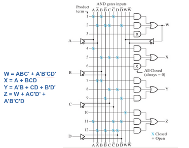

# Arquitectura de Computadoras

## Multiplexores

Es un circuito combinacional que selecciona una de las entradas de datos y la mapea a la *(única)* salida.

La interfaz del multiplexor provee una manera de controlar que entrada es seleccionada. 

Generalmente, tiene *2n* entradas de datos y *n* líneas de selección que determinan cuál de las entradas de datos será la salida.

> Pueden explicar la causa de esa relación.

Un multiplexor de 2 a 1 funciona de la siguiente manera: Si **Se** es **0** => se selecciona la **E0** como salida, en cambio, Si **Se** es **1** => se selecciona la **E1** como salida.

La tabla de verdad para 2 líneas de entrada y 1 línea de selección es la siguiente:

| Se  |  E1 |  E0 |  Sa |
|:---:|:---:|:---:|:---:|
| 0   |  0  |  0  |  0  |
| 0   |  0  |  1  |  1  |
| 0   |  1  |  0  |  0  |
| 0   |  1  |  1  |  1  |
| 1   |  0  |  0  |  0  |
| 1   |  0  |  1  |  0  |
| 1   |  1  |  0  |  1  |
| 1   |  1  |  1  |  1  |

Donde: 
- **Se**: línea de selección
- **En**: líneas de entrada
- **Sa**: línea de salida

La tabla de verdad condensada es:

| Se  |  Sa |
|:---:|:---:|
|  0  |  E0 |
|  1  |  E1 |

> Hagamos en Logisim este multiplexor.

**Pregunta**: Si tengo cuatro líneas de entrada de datos posibles, pueden indicar cuantas líneas de selección y de salida se necesitan.  

## Demultiplexores

El demultiplexor toma una única entrada de datos y pasa esa entrada a un único destino seleccionable.

Normalmente, hay *2n* destinos posibles y, por lo tanto, *n* bits para especificar el destino *(entradas de selección)* 

La codificación binaria resultante de las entradas de selección indica el índice *i* de la salida *Si* a la que se envía la entrada *E*.

Si un demultiplexor tiene 1 línea de selección, va a poder determinar 2 posibles línea de salida *(0 , 1)*.

Por ello la tabla de verdad de un demultiplexor de 1 a 2 es:

| E   |  Se |  S0 |  S1 |
|:---:|:---:|:---:|:---:|
| 0   |  0  |  0  |  0  |
| 0   |  1  |  0  |  0  |
| 1   |  0  |  1  |  0  |
| 1   |  1  |  0  |  1  |

Donde: 
- **E**: línea de entrada
- **Se**: línea de selección
- **Sn**: líneas de salida

La tabla de verdad condensada es:

| Se  |  S0 |  S1 |
|:---:|:---:|:---:|
|  0  |  E  |     |
|  1  |     |  E  |

> Hagamos en Logisim este demultiplexor.

En la práctica se usa un mismo circuito para realizar las funciones de decodificación y demultiplexado esto se puede dar usando un:
- decodificación de N a M.
- demultiplexado 1 de M.

## Dispositivos lógicos programables

No tienen una función lógica preestablecida. Es posible controlar las conexiones o almacenar información para definir la lógica a implementar.

Para poder ser usados necesitan ser programados: un procedimiento de hardware que determina la función a implementar.

Dentro de las tecnologías permanentes podemos encontrar:

- **Fusibles**: Inicialmente cerrados. Se queman con voltajes superiores a los normales y eso abre la conexión.
- **Antifusibles**: Inicialmente abiertos. Contienen un material no conductor que con voltajes elevados se funde y baja la resistencia cerrando la conexión.
- **Programación por máscara**: La realiza el fabricante durante las últimas fases del proceso de fabricación del chip. Dependiendo de la función a implementar, se realizan o no las conexiones sobre las capas de metal que sirven como conductoras en el chip.

En el caso de las tecnologías reconfigurables se puede usar:

- Un dispositivo de almacenamiento de 1 bit que controla un transistor: 
    - Si el bit está en 1, el transistor cierra el circuito. 
    - Si el bit está en 0, el transistor abre el circuito.

Es fácilmente reprogramable, pero necesita alimentación.

Esta basado en transistores floating-gate *(transistor que tiene una puerta flotante aislada en el interior)* conectada de forma capacitiva. Como está aislado permite mantener la carga por largos períodos de tiempo.

Como ejemplos de dispositivos lógicos programables *(Programmable Logic Device, PLD)* se pueden citar:
- Read Only Memory *(ROM)*.
- Programmable Logic Array *(PLA)*.
- Programmable Array Logic *(PAL ®)*.
- Field Programmable Gate Array *(FPGA)*.

Un  PLD  está  formado  por  una  matriz  de  puertas  AND  y  puertas  OR  que  se  pueden programar para conseguir funciones lógicas dadas.

## Conceptos adicionales

Un circuito combinacional presenta un retardo entre la entrada y la salida.

El retardo depende del tipo de compuertas, su cantidad de entradas y el camino *(nivel)* del circuito.

## ROM

Una forma de implementar una función matemática es realizar una tabla de consulta *([lookup table](https://es.wikipedia.org/wiki/Lookup_table))*.

Una ROM *(memoria de solo lectura)* es la forma análoga de implementar una función lógica.

Para una función matemática f, dado un valor de x, se produce f(x). Para una ROM dada una dirección, se produce el valor almacenado en esa dirección.

Por eso decimos que la entrada *(n bits)* especifica la dirección y la salida *(m bits)* es el dato almacenado en la dirección dada.

Es importante aclarar que una ROM no tiene estado, es otro circuito combinacional. Es decir, no representa "memoria". La razón es que una vez que se fabrica una ROM, la salida depende solo de la entrada.

Está formado por un conjunto fijo de puertas AND *(no programable)* conectadas como decodificador y una matriz programable OR. Se utiliza como memoria direccionable y no como dispositivo lógico.

Una ROM de *2n* x *m* tendrá internamente un decoder de *n a 2n* y *m* compuertas OR.

### Sobre las ROM

La ROM *(read  only  memory)*  es una memoria de sólo lectura, es decir, el  procesador puede leer en ella pero no puede escribir en ella. Estos dispositivos no son volátiles, y por tanto son adecuados para almacenar programas o cualquier información que no deba cambiar.

Algunas memorias de sólo lectura son programables por máscara, nos referimos a las memorias **ROM**, lo cual significa que el fabricante del chip lo  programó en la última etapa de la  producción. Ésta es la opción más atractiva para producciones grandes, pero no es adecuada para el desarrollo en bajas cantidades por su elevado coste.

Para pequeños proyectos se pueden usar las memorias de sólo lectura programables o  **PROM**. Éstas existen en muchas variantes,  pero todas permiten que el usuario  programe el dispositivo por si mismo, ahorrándose  el alto costo de la producción de la  máscara.  Una  característica  de  estos dispositivos es que una vez programados no se les puede modificar. Se pueden programar por fusible o antifusible.

Las **EPROM** es un dispositivo de memoria   que  se  puede  programar y luego   reprogramar.El borrado se produce por  exposición a la luz ultravioleta *(UV)*.  Los chips cuentan con una ventana de mica que permite que la luz ultravioleta llegue a la superficie del silicio. La programación se  realiza  generalmente  por  medio  de  un  programador  EPROM. Usan tecnología programable y borrable usando transistores floating-gate.

Las **EEPROM** se  puede  modificar  en  forma  eléctrica  sin  necesidad  de  una  fuente  de  luz ultravioleta. Esto  permite  modificar  o  cambiar  un programa mientras el chip está colocado en su circuito. Usan tecnología programable y borrable electrónicamente usando transistores floating-gate.

Las **memorias FLASH** usan tecnología programable y borrable usando transistores floating-gate con múltiples modos de programación y borrado. Son memorias de lectura/escritura de alta densidad *(se refiere a la gran capacidad de almacenamiento de bits)* que no son volátiles.

##  PLA *(Programmable Logic Array)*

Es un PLD formado por una matriz AND programable y una matriz OR programable. También se denomina FPLA *(Field Programmable Logic Array)* debido a que es el usuario y no el fabricante el que la programa.

Una PLA puede tener el siguiente esquema:

## PAL *(Programmable Array Logic)*

Se ha desarrollado para superar ciertas desventajas de la PLA, tales como largos retardos debidos a fusibles adicionales que resulta de la utilización de dos matrices programables y la mayor complejidad del circuito. La  PAL  básica  está  formada  por  una  matriz  AND programable y una matriz OR fija con la lógica de salida. 

Una PAL puede tener el siguiente esquema:

## FPGA *(Field Programmable Gate Array)*

Las celdas consisten de **tablas de lookup (LUT)**: una pequeña cantidad de lógica y RAM.

Configurar el FPGA requiere configurar los bloques de lógica programable y el conexionado.

Se programam usando lenguajes de descripción de hardware como [Verilog](https://es.wikipedia.org/wiki/Verilog) o [VHDL](https://es.wikipedia.org/wiki/VHDL).
