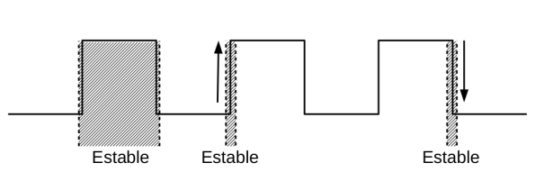

# Circuitos secuenciales

La respuesta de un circuito combinacional depende de las entradas externas.

La respuesta de un circuito secuencial depende:
- De las entradas *(externas)*.
- De la historia pasada *(estado interno)*.

Lo último se logra a través de elementos de memoria.

> En general los sistemas digitales incluyen una parte combinacional y elementos de memoria.

La parte combinacional del circuito:
- Recibe las entradas externas y el estado actual.
- Determina las salidas y el próximo estado del sistema.

Los elementos de memoria almacenan el estado del sistema y hacen que el circuito se describa como secuencial. Tienen dos propiedades:
- **Tiempo de transición**: Retardo entre la variación de la entrada y el cambio en la salida.
- **Capacidad de retención**: Capacidad de mantener el estado aún luego de que las señales que indujeron el cambio hayan desaparecido.

> **Tipos de circuitos secuenciales**
> Por nivel (o asincrónicos): Opera en función de los niveles (valores: 0–1, voltaje alto o bajo) de las entradas.
> Por pulso: Opera en función de los cambios de niveles de las entradas.
> 
> *Trabajaremos con los circuitos secuenciales por pulso*.

## Circuitos secuenciales por pulso

Al menos una de las entradas debe ser un pulso. Típicamente hay una única señal pulso que es el reloj del circuito *(sincrónico)* que es la que dispara el cambio en las salidas.

> Si hay más de una entrada pulso, se asume que no ocurren en simultaneo.

## Reloj

Tren de pulsos correspondiente a una señal periódica. Si, **T** es el período *(segundos)* y **F** frecuencia *(ciclos por segundo ó Hertz)*, entonces:

**F = 1 / T** 

> Ejemplo:
>
> Las compuertas trabajan en el orden de los nanosegundos *(nseg)*.
>
> T = 1 nanosegundo.
>
> F = 1/(1 nseg) = 1/(10-9 seg) = 109 Hz = 1 GHz

> Tarea: vean la tabla de Hz.

## Funcionamiento del reloj

Se debe considerar que el reloj dispara las acciones: durante el pulso, en el flanco ascendente o en el flanco descendente.

## Latches

Son circuito asincrónicos, los cambios en la entrada afectan inmediatamente la salida. Los latches son los bloques constructores de los Flip-flops *(FF)*.

El **latch SR** se construye a partir de dos NOR realimentadas. Tiene dos entradas: S *(set)* y R *(reset)*, y tiene dos salidas: Q y Q'.

Las salidas pueden tener dos estados:
- Q=1 y Q'=0
- Q=0 y Q'=1

Cambian en función de 3 posibles combinaciones de entradas:
- Set: Q→ 1, Q'→ 0
- Reset: Q→ 0, Q'→ 1
- Hold: Q→ Q, Q'→ Q'

| S | R | Q | Q' |
|:--:|:--:|:--:|:--:|
| 0 | 0 | Q | Q' |
| 0 | 1 | 0 | 1 |
| 1 | 0 | 1 | 0 |
| 1 | 1 | Indefinido | Indefinido | 

El **Latch S'R'** es un latch equivalente que puede implementarse con dos NANDs y las entradas negadas.

| S' | R' | Q | Q' |
|:--:|:--:|:--:|:--:|
| 1 | 1 | Q | Q' |
| 1 | 0 | 0 | 1 |
| 0 | 1 | 1 | 0 |
| 0 | 0 | Indefinido | Indefinido | 

**Tarea en clase**: Probémoslos usando LogiSim.

## Flip-flops

Los flip-flops *(biestables)* tienen dos estados estables. Pueden realizar hasta tres operaciones:
- Poner la salida en 1 *(set)*.
- Poner la salida en 0 *(reset)*.
- Complementar la salida *(toggle)*.

Vamos a ver cuatro tipos de flip-flops:

- SR: dos entradas. Realiza set y reset.
- D: una entrada. Realiza set y reset.
- JK: dos entradas. Realiza las tres operaciones.
- T: una entrada. Realiza toggle.

A diferencia del latch, los flip-flips tienen una entrada de control *(Control, Enable, Clock)*. Mientras la entrada de control esté deshabilitada, la salida no cambia *(independientemente de lo que ocurra con las demás entradas)*.

Se debe considerar que las entradas deben estar estables: un poco antes de que la señal de control se habilite, durante el período completo en que esté habilitada y un poco después de que se deshabilite.

La habilitacion puede ser por pulso, por flanco ascendente y por flanco descendente.

**Habilitación por pulso**: Mientras que el pulso se mantenga en el nivel alto, cualquier cambio en las entradas se refleja en las salidas. El pulso no puede ser arbitrariamente angosto.

**Habilitación por flanco ascendente o descendente**: dispara las acciones sólo durante la transición entre niveles. Se logra mayor frecuencia y mejores resultados.

> **Tiempo de set-up (ts)**: Tiempo que las entradas deben estar estables antes del disparo.
>
> **Tiempo de hold (th)**: Tiempo que las entradas deben estar estables después del disparo.
> 
> **Tiempo de propagación (tp)**: Retardo entre el disparo y el cambio en las salidas.
>
> 

Un **flip flop SR** se produce cuando a un latch S'R' o SR se le agrega una entrada de control para indicarle cuándo cambiar las salidas.

| S | R | Q | Q+ |
|:--:|:--:|:--:|:--:|
| 0 | 0 | 0 | 0 |
| 0 | 0 | 1 | 1 |
| 0 | 1 | 0 | 0 |
| 0 | 1 | 1 | 0 |
| 1 | 0 | 0 | 1 |
| 1 | 0 | 1 | 1 |

**Tarea en clase**: Probemos usando LogiSim.

El **flip-flop D** elimina el estado indefinido, asegurandose que las entradas S y R nunca sean iguales. Este FF almacena el dato D.

| D |  Q | Q+ |
|:--:|:--:|:--:|
| 0 | 0 | 0 |
| 0 | 1 | 0 |
| 1 | 0 | 1 |
| 1 | 1 | 1 |

Este flip-flop es muy usado en los procesadores.

El **Flip Flop JK** corrige el estado indefinido del Flip Flop SR. La entrada J pone la salida en 1, la entrada K pone la salida en 0 y si ambas entradas se encuentran habilitadas complementan la salida.

| J | K | Q | Q+ |
|:--:|:--:|:--:|:--:|
| 0 | 0 | 0 | 0 |
| 0 | 0 | 1 | 1 |
| 0 | 1 | 0 | 0 |
| 0 | 1 | 1 | 0 |
| 1 | 0 | 0 | 1 |
| 1 | 0 | 1 | 1 |
| 1 | 1 | 0 | 1 |
| 1 | 1 | 1 | 0 |

El **flip-flop T** hace **toggle** del estado, si T = 1. Es decir si T = 1, cambia el estado del flip-flop.

| T |  Q | Q+ |
|:--:|:--:|:--:|
| 0 | 0 | 0 |
| 0 | 1 | 1 |
| 1 | 0 | 1 |
| 1 | 1 | 0 |

# Registros y contadores (un poco)

Un **registro** esta compuesto por un grupo de Flip Flops *(FF)* que comparten el reloj, cada uno almacena un bit de información. Un registro de *n-bits* esta compuesto de *n* FF. Además de los FF, puede haber compuertas que realicen alguna tarea sobre los datos.

Un **contador** esta compuesto de FF que comparte el reloj y pasan por una secuencia predefinida de estados binarios.

El registro más simple esta compuesto solo de Flip Flops. No tiene compuertas adicionales. Las entradas Di determinan las salidas Qi con cada flanco positivo del reloj.

Podemos agregar una señal *Clear* que resetea las salidas del registro.

En la figura, un reloj común dispara todos los Flip Flops y el dato binario disponible en las entradas D se transfiere a las salidas Q.

**Tarea en clase**: Probemos usando LogiSim.

Un **registro de desplazamiento** *(shift)* tiene la capacidad de desplazar, en una dirección seleccionada, la información binaria en cada Flip Flop al Flip Flop vecino.

Por ejemplo, Shift a derecha: (z0, z1,..., zn) → (0, z0, z1,..., zn-1)

> Puede ser circular.

Se arma mediante una cadena de Flip Flops con reloj común.

Un registro más general de este tipo permite disponer de: 
- Clear para poner el registro en 0.
- Control para desplazar a derecha.
- Control para desplazar a izquierda.

> Como pueden armar un registro paralelo a serie o serie a paralelo.

Un **contador** puede implementarse de diferentes formas, una forma es mediante un contador asincrónico, o contador **ripple**; donde el reloj dispara los cambios en un Flip Flop y la salida de ese Flip Flop sirve como fuente de disparo de los demás Flip Flops.

Un contador binario es aquel que cicla a través de una secuencia de números binarios. Un contador binario de *n-bits* consiste de *n* Flip Flops y puede contar, en binario, desde **0** hasta **2n-1**.

El contador binario en ripple consiste de una serie de FF complementados conectados, donde la salida de cada FF se encuentra conectada al reloj del FF del bit siguiente y el FF del bit menos significativo recibe el pulso de entrada.

Puede implementarse con FF T, FF JK con ambas entradas en 1 o con FF D usando la salida complementada.

