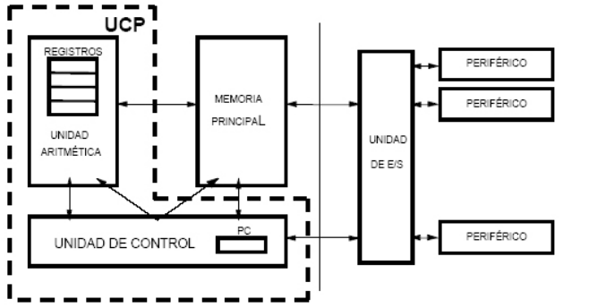
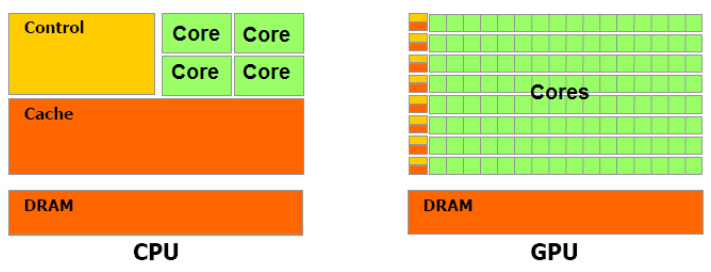
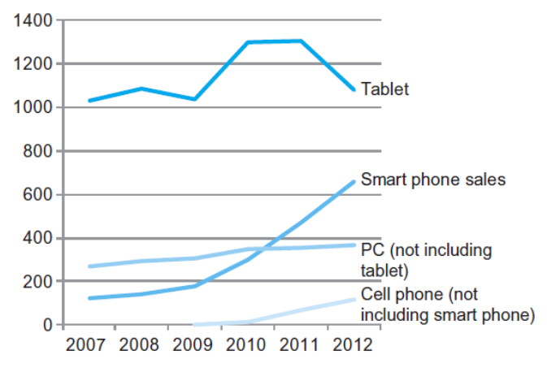
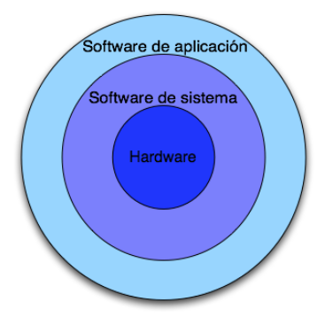
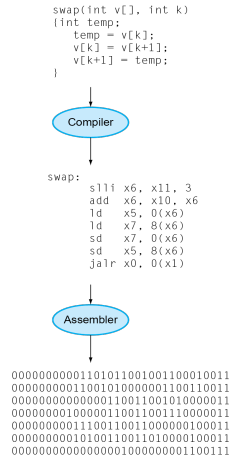

# Arquitectura de Computadores

La arquitectura del computador hace
referencia a todos aquellos elementos del sistema visibles al programador que tienen impacto directo en la ejecución lógica de un programa.

Atributos visibles para un programador
- Juego de instrucciones que ofrece la máquina *(ISA, Instruction Set Architecture)*.
- Tipo y formato de datos que es capaz de utilizar el
computador.
- Número y tamaño de los registros.
- Técnicas y mecanismos de E/S.
- Técnicas de direccionamiento de la memoria.

# Componentes de un computador



Arquitectura Von Neuman & Eckert-Mauchly, *First Draft of a Report on the EDVAC*, 1945.

Repasemos: 

Los datos y las instrucciones deben introducirse en el sistema y se proporcionan los resultados mediante:
Los sistemas de entrada/salida.

Los módulos de E/S comunican el procesador con el exterior.

Se necesita un sitio para almacenar temporalmente las instrucciones y los datos: memoria principal.

Entre los elementos de la memoria principal encontramos:
- Registro de direcciones *(MAR, Memory Address Register)*
- Registro de datos *(MBR, Memory Buffer Register o MDR, Memory Data Register)*
- Señales de control
    - R: Lectura *(Read)*
    - W: Escritura *(Write)*

Al hablar de **espacio de direcciones** nos referimos al número de posiciones de memoria, el **tamaño de cada posición** se encuentra definido por el número de bits por posición.

Para comunicar las distintas partes del computador se usan **buses**. Un bus es un camino de comunicación entre dos o más elementos *(procesador, memoria, etc.)* para la transmisión de información entre ellos, suele formarse por varias líneas de
comunicación, cada una transmite un bit.

Hay tres tipos principales:
- bus de control: señales de control y temporización
- bus de direcciones: designa la fuente o destino de un dato. Su anchura determina la máxima capacidad de memoria del sistema.
- bus de datos: movimiento de datos entre componentes

El procesador es el responsable de la lectura y ejecución de las instrucciones almacenadas en memoria principal. Entre sus componentes encontramos al banco de registros, la unidad de control y la ALU.

Los registros almacenan una secuencia de bits.
Hay dos registros especiales:
- El registro PC *(contador de programa)* contiene la dirección de la siguiente instrucción a ejecutar.
- El registro RI *(registro de instrucción)* almacena la instrucción que se está ejecutando.

La ALU realiza operaciones elementales sobre los
datos. La unidad de control se encarga de generar las señales de control para la ejecución de instrucciones.

# Taxonomía de Flynn

Clasificación de arquitecturas de computadores propuesta por **Michael J. Flynn** en 1972

- **SISD**: una instrucción, un dato.
- **SIMD**: una instrucción, múltiples datos.
- **MISD**: múltiples instrucciones, un solo datos.
- **MIMD**: múltiples instrucciones múltiples datos.

# Clases de computadores

Podemos clasificarlos en:

- **Ordenadores personales**: de propósito general, sujetos a un compromiso entre coste y rendimiento. 
- **Servidores**: Basados en la red, tienen alta capacidad, rendimiento y fiabilidad. Desde servidores pequeños hasta del tamaño de un edificio.
- **Supercomputadores**: Cálculos científicos y de ingeniería de alta gama. Máxima capacidad, representan una pequeña fracción del mercado informático.
- **Sistemas empotrados**: Oculto como componentes de sistemas. Tienen restricciones estrictas de potencia, rendimiento y coste.
- **Sistemas robóticos**: tienen sensores y actuadores *(los anteriores también)*, los más avanzados están basados en microprocesadores.

# Paralelismo

Podemos tener paralelismo interno o explicito.

Cuando hablamos de **paralelismo interno**, se da en máquinas **SISD**, es decir con un solo procesador o CPU. Se logra mediante **segmentación** *(pipelining)* sin replicar hardware.

El **paralelismo explícito** se da en:
- **SIMD**: una única unidad de control que gobierna varias ALUs.
- **MIMD**: varios procesadores que manejan, cada uno, un flujo de instrucciones sobre un
flujo de datos.

Las máquinas **MIMD** tienen un número de procesadores que funcionan de manera
asíncrona e independiente para lograr
paralelismo puro. En cualquier momento, cualquier procesador puede ejecutar diferentes instrucciones sobre distintos datos. Pueden tener memoria compartida o distribuida.

Las máquinas **SIMD** pueden estar basadas en:
- **CPU + juego extendido de instrucciones**: como el repertorio AVX
*(Advanced Vector Extensions, 2008)* de Intel, que se utiliza para álgebra lineal: suma de vectores, multiplicación escalar, multiplicación de matrices, etc.
- **Basic Linear Algebra Subprograms *(BLAS)***: es una interfaz que define un conjunto de rutinas de bajo nivel para realizar operaciones comunes de álgebra lineal. Este conjunto de rutinas suponen el estándar de facto para las librerías de álgebra lineal.
Ejemplos: AMD Core Math Library *(ACML)*, Intel Math Kernel Library *(MKL)*, ATLAS y OpenBLAS.
- **GPU**: en 2007 se produce el gran salto a la computación de propósito general gracias a la primera distribución de Nvidia CUDA. En 2009, se da el *Big Bang* del Deep Learning.



CPU *(Multicore)* vs GPU *(Manycore)*

## CPUs

Las CPUs tienen un diseño orientado a la latencia. 

Se busca una frecuencia de
procesador alta, con cachés grandes que reducen el tiempo medio de
acceso a la jerarquía de memoria.

Control sofisticado con predicción de salto para reducir la latencia por riesgos de control y adelantamiento de datos para reducir la latencia por
riesgos de datos. 

ALU potente que realiza operaciones con poca latencia.

## GPUs

Tienen un diseño orientado al **throughput**.

Usa una arquitectura SIMD, con una frecuencia de procesador moderada, las cachés son pequeñas para impulsar el throughput de memoria.

Control sencillo sin predicción de salto, ni adelantamiento de datos.

ALUs energéticamente eficientes, con muchas unidades con latencia alta y cauce largo para incrementar el throughput. Requiere una cantidad masiva de hilos para *ocultar* la latencia.

Las CPUs y GPUs son complementarias.

Para la partes secuenciales en las que prima la latencia se usan CPUs. Las CPUs pueden ser órdenes de magnitud más rápidas que las GPUs para código secuencial. 

Para las partes paralelas en las que gana el throughput se usan GPUs. Las GPUs pueden ser órdenes de magnitud más rápidas que las CPUs para código paralelo.

# La era post PCs



# Rendimiento

Si medimos el rendimiento de un sistema en MIPS *(millones de instrucciones por segundo)*, se tiene:

```
MIPS = (instrucciones/ciclo) x (ciclos/segundo) x 10^-6
```

Donde:
- instrucciones/ciclo: depende de la
arquitectura.
- ciclos/segundo: depende de la
tecnología utilizada.

Influyen en el rendimiento:
- **Algoritmo**: determina el número de operaciones a ser ejecutadas y el número de operaciones de E/S.
- **Lenguaje de programación, compilador, arquitectura**: determinan el número de instrucciones máquina ejecutadas por operación.
- **Procesador y sistema de memoria**: determinan cómo de rápido se ejecutan las instrucciones.
- **Sistema de E/S** *(incluido el sistema operativo)*: determina cómo de rápido se sirven las operaciones de E/S.

# Abstracción



El software de sistema esta compuesto por:

- **Sistema operativo**: Gestión básica de las operaciones de E/S. Asignación de almacenamiento y memoria. Reparto seguro de los recursos del sistema entre múltiples aplicaciones que se ejecutan de forma simultánea...
- **Compiladores**: un programa que traduce un programa escrito en un lenguaje de alto nivel en instrucciones que el hardware puede ejecutar. Dada la sofisticación de los actuales lenguajes de programación, la traducción de un programa en lenguaje de alto nivel a
lenguaje máquina es compleja.

## Del lenguaje de alto nivel al lenguaje de máquina



El **lenguaje de alto nivel** tiene un nivel de abstracción más cercano al dominio del problema, proporciona productividad y portabilidad.

El **lenguaje ensamblador** es una representación textual de instrucciones.

El **lenguaje máquina** está compuesto de dígitos binarios *(bits)*, las instrucciones y datos se encuentran codificados. 

# Interfaz Hardware - Software

El ISA *(Instruction Set Architecture)* o arquitectura, de un computador es la interfaz entre el hardware y el software de más bajo nivel.

Incluye cualquier cosa que los programadores necesiten saber para hacer que un programa en lenguaje máquina funcione correctamente: instrucciones, dispositivos de E/S, registros,
acceso a memoria, etc.

> El Sistema Operativo encapsula los detalles de la E/S, de la asignación
de memoria y del resto de funciones de bajo nivel => el principio de abstracción es el que permite el desarrollo de sistemas complejos basándose en la ocultación de los detalles de bajo nivel entre niveles sucesivos de una jerarquía.

# ¿Qué es un computador?

**Computador**: máquina destinada a procesar datos. Sobre ellos se aplican unas instrucciones obteniendo
después unos resultados *(datos/información)*.

**Computador digital**: datos e instrucciones en formato binario.

# Componentes de un computador

Todo hardware realiza las mismas funciones básicas
- Entrada de datos
- Salida de datos
- Procesamiento de datos
- Almacenamiento de datos

Los componentes clásicos de un computador son
- Entrada
- Salida
- Ruta de datos y de control o procesador
- Memoria

Cualquier componente de cualquier ordenador se puede clasificar en una de estas categorías con independencia de la tecnología utilizada.

La placa base contiene paquetes de circuitos integrados o chips. Tiene
tres partes:
- La que conecta con los dispositivos de E/S.
- La memoria.
- El procesador.

**Memoria**: programas + datos que necesitan los programas. Normalmente
construida a partir de DRAM *(Dynamic Random Access Memory)*. En la arquitectura Von Neuman existe una única memoria para programas y datos. En la arquitectura Harvard existe una memoria de datos y otra de programas.

**Procesador o CPU**: es la parte activa de la placa base. El procesador contiene:
- La **ruta de datos** encargada de realizar las operaciones aritméticas *(músculo)*.
- La **ruta de control** que indica a la ruta de datos, a la memoria y a los dispositivos de E/S qué hacer de acuerdo a las instrucciones del programa *(cerebro)*.

**Memoria caché**: es un tipo de memoria más pequeña y rápida que actúa como un buffer de la memoria DRAM, basada en tecnología SRAM *(Static Random Access Memory)*.

La información de la memoria principal es volátil, es decir, desaparece cuando no hay energía. Para persistir la información se utiliza la memoria secundaria que es no volátil, ejemplos:
- Discos magnéticos.
- Memoria flash.
- Discos ópticos *(CDROM, DVD)*.

# Tiempo de respuesta Vs throughput

El **tiempo de respuesta** es el tiempo que tarda en realizarse una tarea.

El **throughoput** es la cantidad de trabajo completado por unidad de tiempo.

> **Para pensar**
>
> Indicar si los siguientes cambios en un ordenador incrementan el throughput decrementan el tiempo de respuesta o ambos.
> - Reemplazar el procesador por uno más rápido.
> - Añadir más procesadores a un sistema multiprocesador para la ejecución de múltiples tareas.

Como usuarios nos interesa el tiempo de ejecución. En cambio, como diseñadores nos interesa lo rápido que es el hardware a la hora de ejecutar funciones básicas. Todos los computadores se diseñan utilizando un reloj que marca la realización de determinados eventos en el hardware. Estos intervalos se denominan **ciclos de reloj**.

Consideremos que: 
- **Periodo de reloj**: es el tiempo que se tarda en completarse un ciclo de reloj *(250 picosegundos o 250 ps)*.
- **Frecuencia de reloj**: es la inversa del periodo de reloj *(4 gigahertzios o 4 GHz)*.

Las siguientes fórmulas son particularmente útiles puesto que separan los **tres factores clave que afectan al rendimiento**.

En función de periodo: 

```
Tiempo de CPU = Nro. de instrucciones x CPI x Periodo de reloj
```

En función de la frecuencia:

```
Tiempo de CPU = Nro. de instrucciones x CPI / Frecuencia de reloj
```

El CPI o ciclos por instrucción, es el número medio de ciclos de reloj que se necesitan para ejecutar una instrucción. El CPI nos permite comparar dos implementaciones distintas del mismo ISA.

El **Speedup** se usa para mostrar el efecto en el rendimiento después de cualquier mejora en los recursos, donde:

```
Speedup = (I x CPI x P) sin mejora / (I x CPI x P ) con mejora
```
# Resumen

| Componente hardware o software | ¿A qué afecta? | 
|:------------------------------:|:--------------:|  
| Algoritmo | Recuento de instrucciones y posiblemente al CPI | 
| Lenguaje de programación | Recuento de instrucciones y CPI | 
| Compilador | Recuento de instrucciones y CPI | 
| ISA | Recuento de instrucciones, frecuencia de reloj, CPI | 