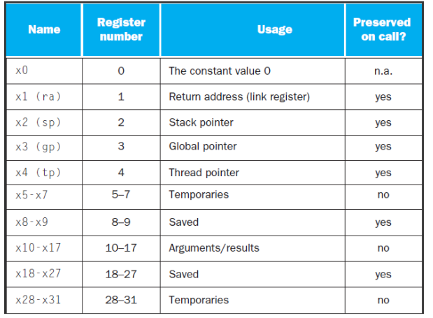

# Diseño de un repertorio de instrucciones

# Tipos de repertorios

Según el tipo de repertorio, las máquinas se pueden clasificar en: CISC *(Complex Instruction Set Computer)* o RISC *(Reduced Instruction Set Computer)*.

**CISC**: Tienen un conjunto de instrucciones que se caracteriza por ser muy amplio y
permitir operaciones complejas entre operandos situados en la memoria o en los registros internos, en contraposición a la arquitectura RISC.

Pertenecen a la primera corriente de construcción de procesadores, antes del desarrollo de los RISC.

**RISC**: es una arquitectura de carga-almacenamiento, tiene como características fundamentales: instrucciones de tamaño fijo y presentadas en un reducido número de formatos; y, solo las instrucciones de carga y almacenamiento acceden a la memoria de datos.

Tienen como objetivos: posibilitar la segmentación y el paralelismo en la ejecución de instrucciones, reducir los accesos a memoria.

Se denominan arquitecturas de carga - almacenamiento.

## Comparativa


| CISC | RISC |
|:-----:|:----:|
|Conjunto grande de instrucciones: operaciones complejas y muchos modos de direccionamiento| Conjunto pequeño de instrucciones: pocos tipos de datos y modos de direccionamiento|
|Programa objeto corto | Programa objeto largo |
|Compilador más sencillo |Compilador más complejo |
|Codificación variable | Codificación fija |
|Hardware más complejo, más lento | Hardware más sencillo, más rápido, más barato |
| Difícilmente optimizable | Fácilmente optimizable |

## Ejemplo 

Supongamos tenemos dos valores en memoria *(direcciones A y B)*, queremos realizar una multiplicación y guardar el resultado en una de las posiciones de memoria *(A)*.

## Solución CISC

Busca completar una tarea en el menor número de líneas de código ensamblador posibles.

El microprocesador debe ser capaz de
comprender y ejecutar una serie de operaciones
complejas. 

La tarea completa puede ser llevada a cabo con una
única instrucción específica: **MUL**

Lenguaje de alto nivel: 

```
a := a * b;
```

Lenguaje ensamblador (CISC): 

```
MUL [A], [B]
```

## Solución RISC

Busca usar instrucciones sencillas que se puedan
ejecutar rápidamente. 

Arquitecturas basadas en registros de propósito
general  que operan siempre sobre operandos
almacenados en el procesador *(registros)*, cerca de la unidad aritmético-lógica.

Lenguaje de alto nivel: 

```
a := a * b;
```

Lenguaje ensamblador (RISC):

```
LOAD X1, [A]
LOAD X2, [B]
MUL X1, X1, X2
STORE [A], X1
```

Muchas alternativas RISC: ARM, MIPS, RISC-V...


## ¿Por qué RISC-V?

Hardware abierto, open-source hardware. Similar a MIPS, que ha sido la arquitectura de referencia utilizada en la mayor parte de los textos docentes disponibles para la enseñanza de Arquitectura de Computadoras.

> Los repertorios de microprocesadores RISC son muy parecidos entre sí, conociendo uno podemos entender fácilmente otros identificando sus particularidades.

RISC-V, fue desarrollado originalmente en la Universidad de California en Berkeley, ofrece una versión simple, elegante y moderna de cómo deberían ser los repertorios de instrucciones actuales.

Más de 40 compañías se han unido a la Fundación RISC-V (www.riscv.org). La lista incluye a
las más importantes como AMD, Google, Hewlett Packard, IBM, Microsoft, NVIDIA, Oracle, y
Qualcomm. La excepción son ARM e Intel.

# Diseño de un repertorio de instrucciones RISC

## Tipo de almacenamiento de los operandos

Los distintos repertorios se diferencian en el tipo de almacenamiento interno que utilizan:
- Pila
- Acumulador
- Registros de propósito general *(General Purpose Registers, GPR)*

**Pila**: los operandos son implícitos, siempre en la parte superior de la pila *(Top of Stack, TOS)*.

No es necesario indicar dónde se encuentran los operandos.

Ejemplo:

```
PUSH AX
PUSH BX
ADD
POP CX
```

**Registro acumulador**: uno de los operandos es implícito, el otro se debe especificar de forma
explícita.

Ejemplo:

```
LOAD A
ADD B
STORE C
```

**Registros de proposito general**: Los operandos se especifican de forma explícita.

Variantes:
- Registro-Registro de 3 operandos: todos deben estar en registros. Se utilizan instrucciones de carga *(load)* y almacenamiento *(store)*.
- Registro-Memoria de 2 operandos: al menos uno de los operandos debe estar en registro.
- Memoria-Memoria de 2 o 3 operandos: todos ellos en memoria.

Casi todas las arquitecturas se basan en Registros de propósito general. Los registros son más rápidos. Son utilizados de manera mucho más eficiente por los compiladores para almacenamiento temporal de variables.

En arquitecturas registro-registro: La codificación es sencilla, siempre hay que especificar el identificador de tres registros.

En arquitecturas memoria-memoria: Código más compacto, menos instrucciones. La memoria, un cuello de botella. Grandes diferencias entre la longitud de las instrucciones y entre su duración. Se complica la codificación de las instrucciones y puede variar mucho el CPI *(Ciclos Por Instrucción)* entre instrucciones.

## Ordenación

La mayoría de las máquinas están direccionadas por bytes. Proporcionan acceso a bytes *(8 bits)*, medias palabras *(16 bits)*, palabras *(32 bits)* y dobles palabras *(64 bits)*..

**Little Endian**: de comienzo por el extremo pequeño. Coloca el byte menos significativo en la posición más significativa de la palabra. La dirección de un dato es la del byte menos significativo.

**Big Endian**: de comienzo por el extremo grande. Coloca el byte menos significativo en la posición menos significativa de la palabra. La dirección de un dato es la del byte más significativo.

**Middle Endian**: arquitectura capaz de trabajar con ambas ordenaciones.

Ejemplo: el valor hexadecimal **0x4A3B2C1D** se codificaría en memoria en la siguiente secuencia:

{4A, 3B, 2C, 1D} en big-endian

{1D, 2C, 3B, 4A} en little-endian


## Alineamiento

En RISC-V, la información almacenada debe
comenzar en direcciones múltiplo del tamaño de la
información almacenada. En

Estos accesos deben estar alineados, es decir, un
acceso a una información de *n* bytes en la dirección del byte *B* está alineado si: **B módulo s = 0**

Estas restricciones de alineamiento se deben a que
las memorias, físicamente, están diseñadas para
hacer accesos alineados. Un acceso no alineado o mal alineado, supone varios accesos alineados a la memoria.

## Modos de direccionamiento

Los modos de direccionamiento determinan la ubicación de los operandos. ¿Dónde se pueden ubicar los operandos?

- En la propia instrucción.
- En un registro.
- En memoria principal.

### Modos de direccionamiento básicos

**Direccionamiento inmediato**: el operando se codifica dentro de la instrucción.


**Direccionamiento a registro**: el operando se encuentra en un registro, se incluye el identificador del registro que almacena el
operando.


Si el operando se ubica en memoria:

**Directo o absoluto**: se incluye la dirección de memoria en la que está almacenado el operando.


**Indirecto**: se indica el registro que almacena la dirección de memoria en la que se encuentra el operando.

**Indirecto con desplazamiento**: se suma un operando inmediato al contenido del registro para obtener la dirección de memoria en la que se encuentra el operando.


### Modos de direccionamiento en un repertorio RISC

Los repertorios RISC incluyen como mínimo direccionamiento inmediato e indirecto con desplazamiento. 


**Direccionamiento inmediato**: a la hora de diseñar el repertorio hay que decidir sí:
1. Todas las instrucciones deben soportar este modo o sólo un subconjunto.
2. El rango de valores del operando inmediato.


**Direccionamiento indirecto con desplazamiento**: la decisión más importante consiste en determinar el rango de valores que puede tomar el desplazamiento.

## Otras consideraciones

### Tipo y tamaño de los operandos:

- ¿Qué tipo de datos se soportan? ¿Con qué tamaños?
Carácter, entero, coma flotante, etc.
- El código de operación, opcode, indicará el tipo de los operandos implicados en la ejecución de la instrucción
- También lo pueden indicar los operandos mediante
etiquetas, ¿inconvenientes?

### Conjunto de operaciones soportadas

- ¿Qué tipo de operaciones van a realizar las instrucciones del repertorio?
- Un conjunto sencillo: aritmético-lógicas (ALU), de acceso a memoria, de control de flujo (saltos) y llamadas al sistema operativo.
  
### Tratamiento de las instrucciones de control de
flujo

Modifican el flujo de control de un código.

Podemos tener: 

**Saltos condicionales**: Se deben considerar:
- ¿Cómo se especifica la condición?
- ¿Cómo se indica la dirección destino de salto?

**Saltos incondicionales**: Se deben considerar: ¿Cómo se indica el destino?

**Direccionamiento relativo al PC** *(branch)* 
- Se conoce el destino de salto en tiempo de compilación.
- Los destinos de los saltos están cercanos al salto.
- Código reubicable
- ¿Cuántos bits se necesitan para el desplazamiento?

**Direccionamiento indirecto con registro** *(jump)*: Se usa cuando no se conoce la dirección de salto o su valor excede del que se puede indicar con el desplazamiento, se indica el identificador del registro que contiene la dirección destino de salto.

### Codificación del repertorio de instrucciones


**Longitud variable**: 
- Soporta cualquier número de operandos y cualquier combinación instrucción/modo de direccionamiento.
- Etiquetas que indican el modo.
- Se añaden tantos campos como sean necesarios + las etiquetas que permiten su interpretación.

**Longitud fija**:

- El código de operación especifica el modo de direccionamiento.
- Sólo se permiten unas combinaciones determinadas de operaciones + modos.
- Los campos de la instrucción son siempre los mismos.

**Híbrida**:
- Como los de longitud fija, pero se permiten unos determinados formatos de instrucción, que incluyen un número variable de modos y operandos.

# Hablemos de RISC-V

Es una arquitectura RISC basada en registros de propósito general de tipo carga/almacenamiento.

Los operandos de una instrucción siempre deben estar almacenados en registros dentro del
procesador *(no puedan estar en memoria)*.

Los resultados siempre se devuelven a registros
dentro del procesador.

La arquitectura del RISC-V se basa en un juego
de instrucciones de longitud fija.

Tiene 32 registros de propósito general de 64 bits.

## Banco de registros 



## Memoria

Dividida en: 

- **Text:** almacena el código del programa *(código ejecutable)*.
- **Static data**: almacena variables declaradas para las que se reserva memoria en tiempo de compilación.
- **Heap**: almacena datos para los que no se ha reservado memoria en tiempo de compilación, son datos creados en tiempo de ejecución.
- **Stack**: invocación de subrutina *(procedimiento o función)*.


Existe un convenio de llamada a subrutina:


En cuanto al alineamiento de los datos tenemos:

- **Byte**: 1byte, 8 bits, **b**.
- **Halfword**: media palabra, 2 bytes, 16 bits, **h**.
- **Word**: palabra, 4 bytes, 32 bits, **w**.
- **Double Word**: doble palabra, 8 bytes, 64 bits, **d**.

## Modos de direccionamiento


## Tipos de Instrucciones


## Operaciones aritméticas

Ejemplo, Código en Pascal:
```
a := b + c + d + e;
```

RISC-V emplea una notación rígida donde cada instrucción aritmética realiza una única operación y siempre tiene tres operandos: dos fuente y uno destino.

Si queremos sumar b, c, d y e en a:

```
add a, b, c
add a, a, d
add a, a, e
```

El hardware para un número variable de `operandos es más complicado que el hardware para un número fijo de operandos.

Cuatro principios de diseño del hardware:

**Principio de diseño I**: La regularidad favorece la simplicidad. La simplicidad permite un mayor rendimiento a un menor costo.

Otro ejemplo: 

Código en Pascal:

```
f := (g + h) - (i + j);
```
Código compilado RISC-V:

```
add t0, g, h 
add t1, i, j 
sub f, t0, t1
```

Los operandos de las instrucciones aritméticas son limitados y se corresponden físicamente con una parte del hardware del computador denominada **registros**.

> Los registros son una parte del hardware visible a los programadores.

Los registros son limitados, esto los diferencia de las variables de un programa. Tenemos 32 registros.

Esta limitación en el número de registro viene impuesta por el:

**Principio de diseño II**: Más pequeño es más rápido. 

Un mayor número de registros supone incrementar el ciclo de reloj puesto que a las señales electrónicas les lleva más tiempo recorrer distancias más largas.

Los registros son:

**x0**: valor constante 0, registro cableado a 0

**x1**: dirección de retorno

**x2**: puntero de pila

**x3**: puntero a zona de variables estáticas, global

**x4**: puntero de hilo

**x5 – x7, x28 – x31**: registros temporales

**x8**: puntero de marco de pila

**x9, x18 – x27**: registros estáticos

**x10 – x11**: argumentos subrutina/valor retorno subrutina

**x12 – x17**: argumentos subrutina

## Operandos en memoria

Se usa la memoria principal para almacenar datos complejos: Arrays, estructuras, datos dinámicos.

Para poder realizar operaciones aritméticas se debe:
- Cargar *(load)* los valores de memoria a registros.
- Almacenar *(Store)* el resultado de registro a memoria.

La memoria se direcciona por bytes, cada dirección identifica un byte.

RISC-V es Little Endian: byte menos significativo en la dirección más significativa.

A diferencia de otros ISAs, en RISC-V no es obligatorio que los datos estén alineados en memoria.

## Registros Vs Memoria

Los registros son más rápidos que la memoria, se necesita menos energía para acceder a los
registros que a la memoria.

Operar con datos en memoria requiere de *load* y
*store*, por ende se debe ejecutar un mayor número de instrucciones más lentas.

El compilador debe usar los registros todo lo
posible para ello debe usar memoria solo para variables poco utilizadas.

> La optimización de los registros es importante.

## Operandos inmediatos

Las instrucciones inmediatas ilustran el
tercer principio de diseño.

**Principio de diseño III**: Haz que el caso más común sea rápido.

La constante cero tiene el rol de simplificar el juego de instrucciones ofreciendo variaciones útiles.

RISC-V tiene un registro cableado a cero, se trata del registro zero que se corresponde con el registro número 0.

## Formatos de instrucción

¿Qué pasa si una instrucción necesita campos más largos? Conflicto entre el deseo de que todas las instrucciones tengan la misma longitud y el deseo de tener un único formato de instrucción.


**Principio de diseño IV**:Un buen diseño demanda buenos compromisos. 

El compromiso elegido por los diseñadores del RISC-V es mantener todas las instrucciones con la misma longitud, pero requiere de distintos formatos de instrucción para distintos tipos de instrucciones.

### Instrucciones de tipo R


Uso: instrucciones aritmético-lógicas registro-registro
- opcode: código de operación
- rd: número del registro destino
- funct3: 3-bit código de función *(adicional al código de operación)*
- rs1: número del primer registro fuente
- rs2: número del segundo registro fuente
- funct7: 7-bit código de función *(adicional al código de operación)*

### Instrucciones de tipo I


Uso: instrucción de carga *(Load)*
- rs1: número del registro fuente, dirección base para el acceso a memoria
- rd: número del registro destino
- immediate: desplazamiento para el cálculo de la dirección de memoria a la que hay que acceder

Uso: instrucciones aritmético-lógicas con operando inmediato
- rs1: número de registro del primer operando fuente
- rd: número del resgistro destino
- immediate: valor del segundo operando Fuente
- funct3: código de función de 3-bits (adicional al código de operación)

### Instrucciones de tipo S


Uso: instrucción de almacenamiento *(store)*
- opcode: código de operación
- rs1: número del registro fuente, dirección base para el acceso a memoria
- rs2: número del resgistro destino
- immediate: desplazamiento para el cálculo de la dirección de memoria a la que hay que acceder
    - Campo partido, para que los campos rs1 y rs2 siempre estén en el mismos sitio
- funct3: código de función de 3-bits (adicional al código de operación)

### Instrucciones de tipo SB


Uso: Salto *(cercano)* condicional hacia delante o hacia atrás, salto relativo al PC.

- Dirección destino de salto = PC + immediate × 2
- opcode: código de operación
- rs1: número del registro fuente, dirección base para el acceso a memoria
- rs2: número del registro destino
- immediate: desplazamiento para el cálculo de la dirección de memoria a la que hay que acceder
    - Campo partido, para que los campos rs1 y rs2 siempre estén en el mismos sitio.
- funct3: código de función de 3-bits (adicional al código de operación)