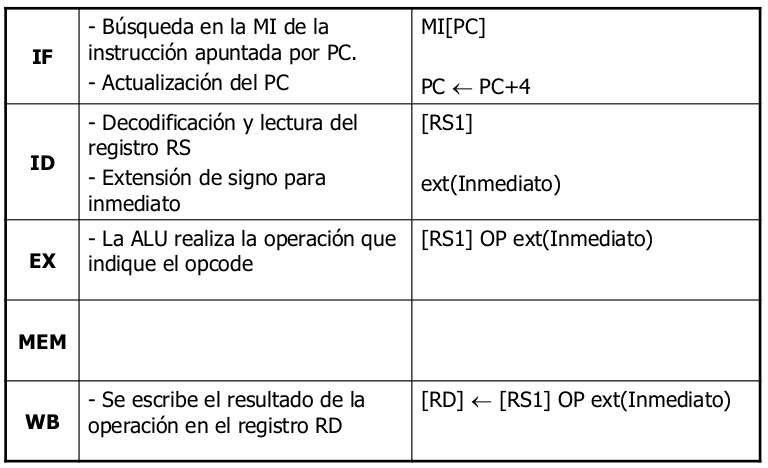
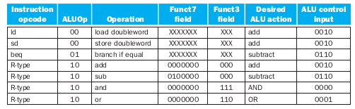
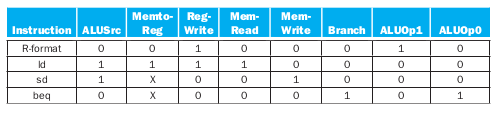
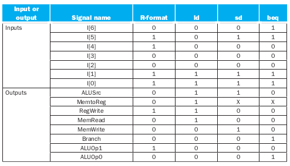

# El procesador

# Ruta de datos y de control

Estudiaremos técnicas para implementar la ruta de datos y de control al construir un procesador.

Examinaremos dos implementaciones RISC-V:
- procesador monociclo
- procesador multiciclo

Nos centraremos en el estudio de una arquitectura RISC-V simplificada, denominada **nanoRISC-V**, con las siguientes instrucciones:
- Referencia  a memoria: ld (I) , sd (I)
- Aritmético/lógicas: add , sub , and , or (R)
- Transferencia de control: beq (SB)

# Pasos para ejecutar una instrucción

1. PC -> memoria de instrucciones (MI), buscar siguiente instrucción
2. Número de registro -> banco de registro (BR), lectura de operandos
3. Dependiendo de la clase de instrucción:
Uso de la ALU para calcular
    - Resultado aritmétido
    - Dirección de memoria para load/store
    - Comparación de registros
- Acceso a la memoria de datos (MD) para load/store
- PC = dirección destino de salto o PC + 4

Donde:
- **Fetch (IF)**: buscar en la memoria la instrucción apuntada por el PC. Actualización del PC
- **Decode (ID)**: decodificación de la instrucción, separar los diferentes campos. Si es necesario, se leen 1 o 2 operandos de los registros.
- **Execution (EX)**: ejecución de la operación indicada en el opcode
- **Memory Access (MEM)**: si es necesario,
acceder a memoria para leer o escribir.
- **Writeback (WB)**: si es necesario, se almacena un resultado en un registro.

# Ejecución de una instrucción: ld/sd (Tipo I)

# Ejecución de una instrucción: ALU (Tipo I)

# Ejecución de una instrucción: ALU (Tipo R)

# Ejecución de una instrucción: Branch (Tipo SB)

# Elementos

En la construcción del procesador vamos a usar:
- Compuertas (AND, etc.)
- Sumadores
- Multiplexores
- ALU

La ALU opera sobre los datos de una instrucción, los tipos de  operaciones son:
desplazamientos, lógicas y aritméticas.

En la mayoría de los casos, es un simple sumador-restador. Las multiplicaciones y divisiones se pueden hacer:
- **Vía hardware**: más rápido, pero ALU más cara
- **Vía software**: ALU sumador-restador + algoritmo, más lento pero ALU más barata

La ALUs en complemento a dos hace más sencillo el circuito de la ALU.

# Procesadores secuenciales

Hasta que no termina de ejecutar una instrucción no comienza a ejecutarse la siguiente.

Según el método de temporización escogido tenemos:
- **Procesador monociclo**: Cada instrucción se completa en un único ciclo de reloj, por ende el CPI = 1 y la duración del ciclo de reloj viene fijada por la instrucción que más tarda en ejecutarse.
- **Procesador multiciclo**: Cada instrucción puede tardar más de un ciclo en ejecutarse, por ende CPI > 1, la duración del ciclo de reloj es menor que para monociclo y se establece que la **duración de un ciclo = duración de la etapa más larga**.

Las Instrucciones soportadas por el nanoRISC-V son:
- Acceso a memoria: ld (I) , sd (I)
- Aritmético-lógicas: add , sub , and , or (R)
- Control de flujo: beq (SB)

Donde tenemos: 

> En el libro se usa como ejemplo RISC-V de 64 bits.

# Diseño ruta de datos y de control

Los pasos a realizar son:
1. Análisis del repertorio de instrucciones a ejecutar.
2. Establecer la metodología de temporización.
3. Seleccionar los módulos necesarios para operar y almacenar datos. Formarán la ruta de datos teniendo en cuenta el repertorio de instrucciones y la metodología de temporización.
4. Ensamblar la ruta de datos conectando los módulos escogidos e identificando los puntos de control.
5. Determinar los valores de los puntos de control para cada instrucción del repertorio.
6. Diseñar la unidad de control.
7. Optimizar el diseño obtenido, por ejemplo implementando segmentación.

Veamos las etapas:

# Etapa IF-Instruction Fetch

# Instrucciones de tipo R

Se debe leer dos operandos/registros fuente, realizar una operación aritmética/lógica y almacenar el resultado en el registro destino.

# Instrucciones Load/Store

Se debe leer operandos/registros fuente, calcular dirección de memoria usando el offset de 12-bit *(Usar ALU, pero extender de signo el offset)*

En el caso de:
- Load: Leer memoria de datos y actualizar registro.
- Store: Escribir en memoria de datos el valor del registro.

> Recibo para extender el signo la instrucción completa, por eso el bus especifica 32, dentro del proceso de extensión solo selecciona los 12 bits necesarios. 

# Instrucciones de salto condicional

Se debe leer los operandos/registros fuente
, comparar los operandos: para ello usar la ALU, restar y comprobar salida Zero.

Luego Calcular dirección destino de salto, para ello realizar extensión de signo del desplazamiento, Shift left 1, meter un 0 por la derecha y sumar el resultado al PC.

# Disposición de los elementos

El procesador monociclo ejecuta una
instrucción en un ciclo de reloj. Cada elemento de la ruta de datos solo puede
ejecutar una tarea a la vez. Por lo tanto, la memoria de datos y de instrucciones deben estar separadas. Se debe usar multiplexores donde se utilizan
fuentes de datos alternativas para
diferentes instrucciones.

> Si tengo una memoria de instrucciones y otra de datos estoy en una arquitectura Harvard

La ruta de datos de las instrucciones tipo
R/Load/Store queda:

La ruta de datos completa queda:

# Unidades de control procesador monociclo

Vamos a tener dos unidades de control:
- la **Unidad de control global** que decodifica el campo *Opcode* y realiza una configuración global de la ruta de datos.
- la **Unidad de control local a la ALU** que se encarga de decodifica los campos *Funct* y genera la señal *ALU Control* dependiendo de la operación concreta a realizar

En resumen tenemos una decodificación multinivel donde: la unidad de control global decodifica la instrucción leyendo su opcode y la unidad de control local de la ALU realiza una segunda decodificación leyendo el o los campos Funct.

Dependiendo de la clase de instrucción, la ALU deberá realizar una de estas cuatro funciones:
- para cargar y almacenar datos, usamos la ALU para calcular la dirección de memoria mediante la suma. 
- Para las instrucciones de tipo R, la ALU necesita realizar una de las cuatro acciones *(Y, O, sumar o restar)*, dependiendo de
el valor del campo funct7 de 7 bits (bits 31:25) y el campo funct3 de 3 bits (bits 14:12) en la instrucción. 
- Para el salto condicional si la instrucción es igual (beq), la ALU resta dos operandos y prueba para ver si el resultado es 0.

Es posible generar la entrada de control de la ALU de 4 bits utilizando una pequeña unidad de control que tiene como entradas los campos **funct7** y **funct3** de la instrucción y un campo de control de 2 bits, que llamamos **ALUOp**. 

**ALUOp** indica si la operación a realizar debe ser la suma *(00)*, la resta y probar si es cero *(01)*  o si debe ser determinada por la operación codificada en los campos funct7 y funct3 *(10)*.

La salida de la unidad de control ALU es una señal de 4 bits que controla directamente la ALU generando una de las combinaciones de 4 bits mostradas anteriormente.

Este estilo de usar múltiples niveles de decodificación, es decir, la unidad de control principal genera los bits ALUOp, que luego se utilizan como entrada a la unidad de control de la ALU que genera las señales reales para controlar la ALU, es una técnica de implementación común. 

El uso de múltiples niveles de control puede reducir el tamaño de la unidad de control principal. El uso de varias unidades de control más pequeñas también puede reducir potencialmente la latencia de la unidad de control. 

Estas optimizaciones son importantes, ya que la latencia de la unidad de control es a menudo un factor crítico para determinar el tiempo del ciclo del reloj.

Hay varias formas diferentes de implementar el mapeo desde el campo ALUOp de 2 bits y los campos de función a los cuatro bits de control de operación de ALU. Debido a que solo una pequeña cantidad de los posibles valores de los campos de función son de interés y los campos de función se usan solo cuando los bits de ALUOp son iguales a 10, podemos usar una pequeña parte de la lógica que reconoce el subconjunto de valores posibles y genera las señales de control de la ALU.

La tabla de verdad resultante es:

En la unidad de control global, las señales de control derivan de las instrucciones que tienen el siguiente formato:

Que podemos ver:

- El campo de código de operación siempre está en los bits 6: 0. Dependiendo del código de operación, el campo funct3 (bits 14:12) y el campo funct7 (bits 31:25) sirven como un campo de código de operación extendido.
- El primer operando de registro siempre está en las posiciones de bit 19:15 (rs1) para el instrucciones de tipo R y de salto. Este campo también especifica el registro base
para instrucciones de carga y almacenamiento.
- El segundo operando de registro siempre está en las posiciones de bit 24:20 (rs2) para las instrucciones de tipo R e instrucciones de salto. Este campo también especifica el registro operando que se copia a la memoria para almacenar instrucciones.
- Otro operando también puede ser un desplazamiento de 12 bits para instrucciones de salto o de almacenamiento o carga.
- El registro de destino siempre está en las posiciones de bit 11: 7 (rd) para las instrucciones de tipo R y de carga.

> Principio de diseño: la simplicidad favorece la regularidad

En el procesador tenemos 6 señales de control, las cuales son:

Las ocho señales de control *(seis anteriores y dos para ALUOp)* se configuran en función de las señales de entrada a la unidad de control, que son los bits de código de operación 6:0.

Donde se deben activar de acuerdo a la siguiente tabla:

Resultando en la siguiente tabla de verdad:

> Las señales de control permanecen activas
hasta que finaliza el ciclo. Cuando llega una nueva subida del flanco de reloj, se vuelve a comenzar el proceso.

# Ruta de Datos y Unidad de Control del procesador monociclo

Ruta del procesador monociclo:

En el caso de tipo R:

En el caso de Load:

En el caso de Beq:

# Sobre el rendimiento 

La instrucción más lenta determina la
duración del ciclo de reloj, no es posible variar el período para diferentes instrucciones, por ende viola el principio de diseño: Hacer el caso común rápido.

> Mejora del rendimiento por medio del
procesador multiciclo. 

