# Segmentación

Las arquitecturas basadas en Von Neumann o Harvard presentan limitaciones técnicas en la velocidad de proceso que pueden alcanzar.


Se deben buscar arquitecturas alternativas que utilizan varias unidades de procesamiento. 


Podemos implementar **paralelismo interno** *(con una única CPU)* usando 
**segmentación**, en este caso no hay hardware replicado. O podemos implementar **paralelismo explícito** *(con varias CPUs)* mediante  SIMD, MISD o MIMD.


Ambas técnicas están orientadas a mejorar el rendimiento, es decir, el número de instrucciones realizadas por unidad de tiempo, incrementando el número de
módulos hardware que operan simultáneamente. 

En **segmentación** o **Pipelining** el hardware no está replicado, sólo está
dividido en varias etapas distintas la ejecución de una instrucción. 


Si hablamos de **arquitecturas paralelas**
el hardware si está replicado, por lo que
varias instrucciones pueden ejecutarse de
forma simultánea.

## Ejemplo

Veamos un ejemplo de ejecución secuencial, paralelo o segmentando:

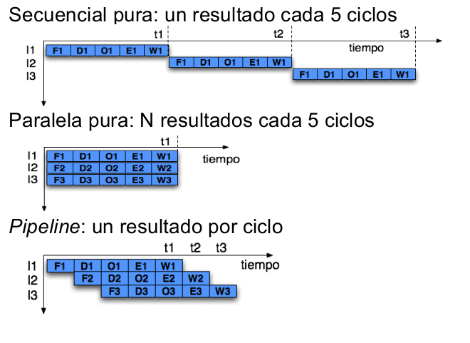


En los procesadores secuenciales, hasta que no termina de ejecutarse una instrucción no comienza a ejecutarse la
siguiente.

En este tipo de procesadores tenemos:
- **Procesador monociclo**: la duración del ciclo de reloj vendrá fijada por la instrucción más lenta.
- **Procesador multiciclo**: la duración de la etapa más larga es la que fija el periodo del reloj.


Los procesadores segmentados, permiten solapar en el tiempo la ejecución de varias instrucciones. Aprovecha el paralelismo a nivel de instrucción, **pipelining**. 

> Es normal que los microprocesadores actuales de propósito general incorporen **pipelining**

# Conceptos básicos

¿Qué es lo deseable? CPI = 1. El Periodo de reloj se encuentra limitado por la etapa más lenta.

La segmentación surgió como una técnica para el aumento de prestaciones, debido a que ejecutando una única instrucción cada vez, el hardware está desaprovechado la mayor parte del tiempo.

En este caso  múltiples instrucciones se solapan en la ejecución. 

Cada etapa opera en paralelo con otras etapas pero sobre instrucciones diferentes

Se puede aplicar porque las fases por la que pasa una instrucción no usan todas los componentes de la ruta de datos, se explota el paralelismo a nivel de instrucciones.

El paralelismo mejora el rendimiento, consideremos el ejemplo de la lavandería:

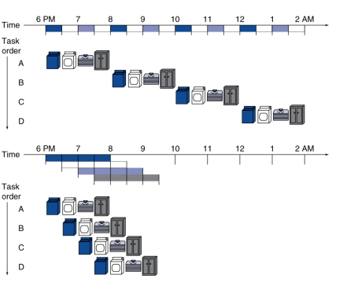

Cada tarea, ocupa cuatro etapas, donde cada etapa dura 0,5 horas *(tiempo total de la tarea: 2 horas en un esquema secuencial)*.

Si se hacen 4 tareas el tiempo es de 8 horas en la ejecución secuencial.

Si usamos un esquema segmentando *(utilizando cada etapa una vez que queda libre)*, tenemos una duración de 3,5 horas para las cuatro tareas.

Entonces el **speedup** es de 8 horas / 3.5 horas = **2,3**.

Resultan en general para este caso la siguiente formula: 

Speedup = (2 * n) / (0.5 * n) + 1.5

En el RISC-V que venimos trabajando vamos a implementar un cauce de 5 etapas, con 1 ciclo por etapa:
1. IF: Búsqueda de la instrucción en la Memoria de Instrucciones.
2. ID: Decodificación y Lectura de operandos.
3. EX: Ejecutar operación en la ALU ó calcular dirección de memoria.
4. MEM: Acceso a Memoria de Datos.
5. WB: Escribir el resultado en el Banco de Registros.

## Latencias


La latencias de los módulos, si consideramos:
- 100ps para lectura o escritura del BR
- 200ps para el resto de etapas

Nos da: 

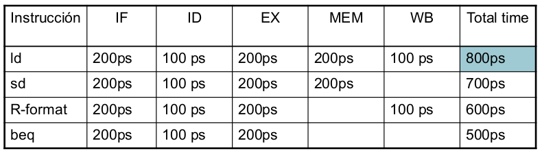

En el caso del procesador segmentado cada etapa se equipara al tiempo de la etapa de mayor lentitud. 

En el procesador monociclo, el procesador funciona a la velocidad de la instrucción de mayor lentitud.

Esto resulta en:

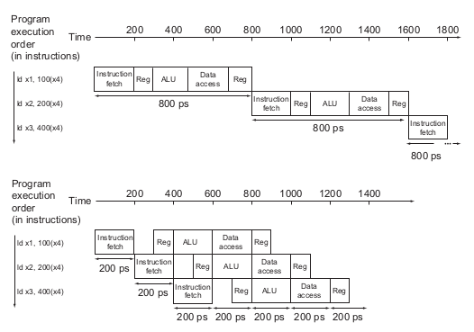

En este caso, vemos una aceleración cuatro veces mayor en el tiempo promedio entre instrucciones, desde 800 ps hasta 200 ps. 

Los tiempos de cada etapa del pipeline de una computadora también están limitados por el recurso más lento, ya sea la operación ALU o el acceso a la memoria. 

En un pipeline todas las instrucciones deben cumplir con todas las etapas.

## Ruta de datos

Existen algunos problemas al armar la ruta de datos: 

- Colisión en el acceso a memoria: en las etapas IF y MEM.
- Colisión en el acceso al banco de registros: en las etapas ID y WB.
- El PC cambia en IF, pero las instrucciones de salto lo pueden modificar en la etapa MEM.

Cada caso se puede solucionar de la siguiente forma: 

- Se separa las memorias de instrucciones y datos, accediendo a una en IF y a la otra en MEM.
- La escritura en los registros se realiza en la primera mitad del ciclo de reloj, y la lectura en la segunda mitad del ciclo de reloj.¿Por qué no hacemos lo mismo con la memoria?
- Agregamos un multiplexor en la etapa IF
- Agregamos un restador en la etapa EX para realizar al mismo tiempo la suma
del desplazamiento al PC en la ALU y la comparación de los registros en el caso de las instrucciones BEQ.
- Agregamos registros de segmentación: se encargan de almacenan el resultado de
cada etapa al final del ciclo de reloj. Cada registro de segmentación tendrá
una longitud diferente dependiendo de la información que tenga que almacenar.

Resultando el sistema en:

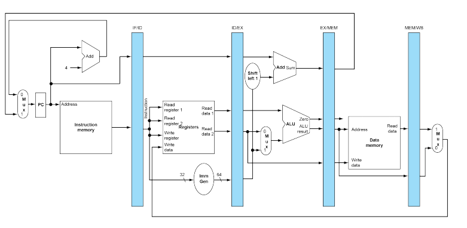

Estos cinco componentes corresponden aproximadamente a la forma en que se dibuja la ruta de datos.

Las instrucciones y los datos se mueven generalmente de izquierda a derecha a través de las cinco etapas a medida que completan la ejecución.

Sin embargo, hay dos excepciones a este flujo de instrucciones de izquierda a derecha:
- La etapa de escritura diferida *(write back)*, que vuelve a colocar el resultado en el banco de registros en el medio de la ruta de datos.
- La selección del siguiente valor del  PC, eligiendo entre el valor de PC incrementado y la dirección de salto de la etapa MEM.

Los datos que fluyen de derecha a izquierda no afectan la instrucción actual; estos movimientos de datos inversos influyen solo en instrucciones posteriores en el pipeline. 

Tengan en cuenta que el primer flujo de datos de derecha a izquierda puede conducir a **peligros de datos** y el segundo conduce a **peligros de control**.

Los registros del  pipeline, separan cada etapa de la tubería.

Están etiquetados por las etapas que separan.

Los registros deben ser lo suficientemente amplios para almacenar todos los datos correspondientes a las líneas que los recorren. 

Por ejemplo, el registro IF/ID debe tener 96 bits de ancho, ya que debe contener tanto la instrucción de 32 bits extraída de la memoria como la dirección de PC de 64 bits incrementada.

Ampliaremos estos registros a lo largo de este capítulo, pero por ahora los otros tres registros contienen 256, 193 y 128 bits, respectivamente.

> Analicen porque.

## Pasos para Load y Store 

A continuación vamos a ver los pasos para ejecutar la instrucción load o store en el pipeline:

- IF para load y store:
  
    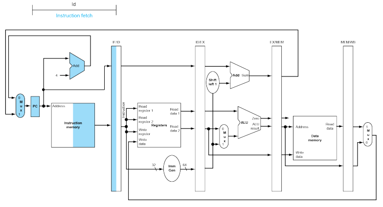

- ID para load y store:
  
    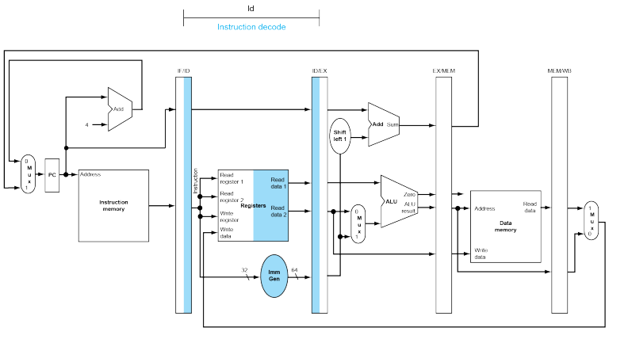

- EX para load:
  
    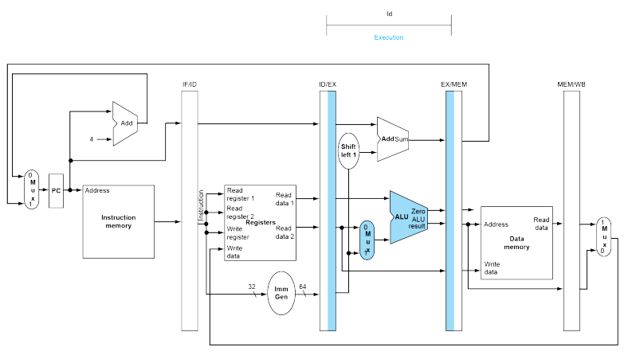

- MEM para load:

    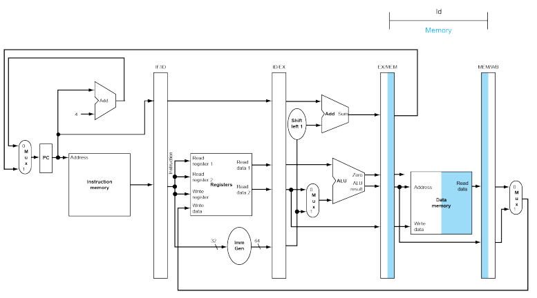

- WB para load:
  
    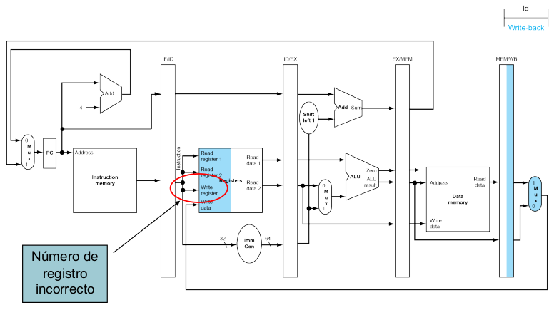

    Existe un error, de número de registro incorrecto. A que se debe?

- Esto se soluciona de la siguiente forma: 

    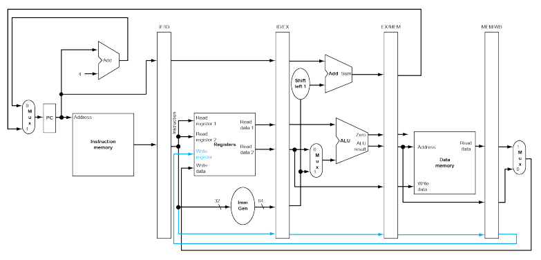


    El número de registro de escritura ahora proviene del registro del pipeline MEM/WB junto con los datos. El número de registro se pasa desde la etapa de pipeline de ID hasta que llega al registro MEM/WB, agregando cinco bits más a los últimos tres registros de pipeline. Este nuevo camino se muestra en color celeste.

- EX para store:

    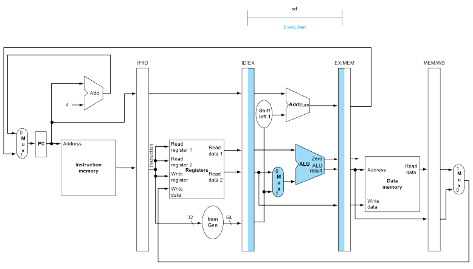

- MEM para store:
  
    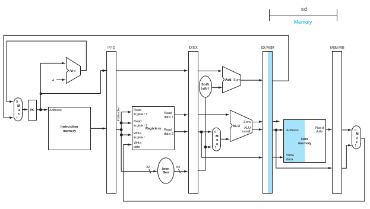

- WB para store:
  
    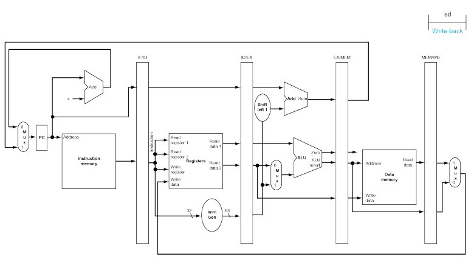

Veamos como se ejecutan en el pipeline las siguientes instrucciones:

```
ld  x10, 40(x1)
sub x11, x2, x3
add x12, x3, x4
ld  x13, 48(x1)
add x14, x5, x6
```

En un esquema de uso de recursos:

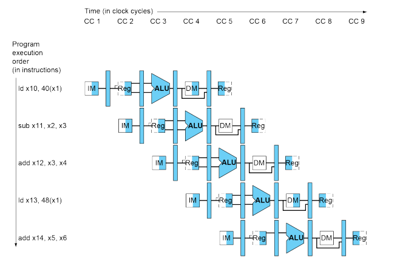

Lo mismo pero usando un esquema tradicional:

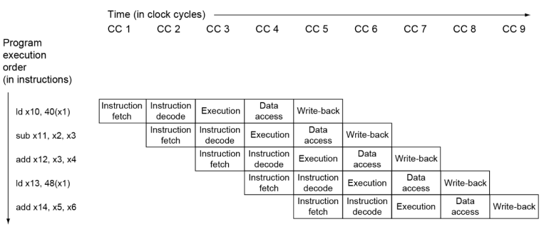

## Pipeline de control

Recordemos que usamos una decodificación multinivel usando una unidad de control Global y unidad control de la ALU.

En la etapa ID, el opcode permite generar todas las señales de control necesarias. Las señales se deben propagar por los registros de segmentación.

Para las señales de control tenemos un circuito combinacional que genera las señales para cada tipo de
instrucción a partir del opcode, se deben dimensionar los registros de segmentación para que las incluyan.

A continuación especificamos hasta que etapa debe llegar cada señal: 
- EX = ALUSrcA, ALUSrcB, ALUOp y RegDst
- MEM = Branch, MemRead y MemWrite
- WB = MemToReg y RegWrite

Veamos cada etapa:
1. Búsqueda de instrucciones: Las señales de control para leer la memoria de instrucciones y escribir en el PC siempre se realizan, por lo que no hay nada especial que controlar en esta etapa.
2. Decodificación de instrucciones / Lectura del banco de registros: Los dos registros fuente están siempre en la misma ubicación en los formatos de instrucción RISC-V, por lo que no hay nada especial que controlar en esta etapa.
3. Ejecución / cálculo de direcciones: Las señales a configurar son ALUOp y ALUSrc. Las señales seleccionan la operación a realizar en la ALU y define la entrada en la ALU.
4. Acceso a la memoria: Las líneas de control establecidas en esta etapa son Branch, MemRead y MemWrite. Las instrucciones de salto condicional si los valores son iguales, de carga y de almacenamiento establecen estas señales, respectivamente. Recuerden que PCSrc selecciona la siguiente dirección secuencial a menos que la unidad de control afirme Branch y el resultado de ALU sea 0 *(zero)*.
5. Write-back: Las dos líneas de control son MemtoReg, que decide entre enviar el resultado de ALU o el valor de la memoria al banco de registros, y RegWrite, que especifica el destino.

Esto resulta en:

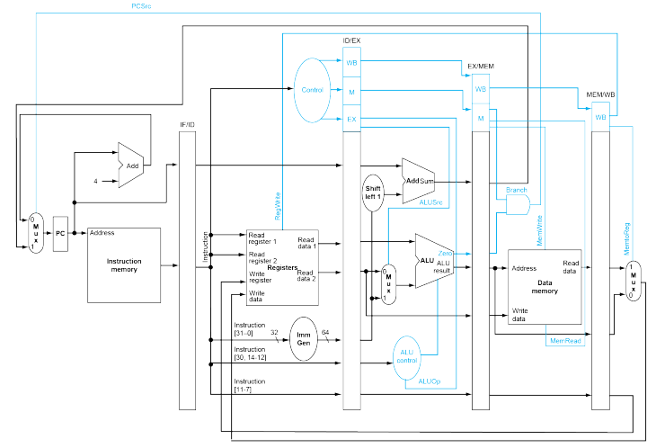

## Consideraciones

El ISA del procesador RISC-V se diseñó para ser ejecutado en un pipeline:
1. Todas las instrucciones tienen la misma longitud, lo que facilita las etapas IF y ID.
2. RISC-V solo tiene unos pocos formatos de instrucciones: encontrar los registros fuente en los mismos campos permite la
lectura de los operandos al mismo tiempo que se decodifica la instrucción. En caso contrario necesitaríamos partir en dos la
etapa ID.
3. Operandos en memoria solo existen en las instrucciones load/store, por lo que podemos utilizar la etapa de ejecución para calcular la dirección de memoria
4. Los operandos deben estar alineados en memoria, por lo que solo se necesita un acceso a memoria

> En general, el ISA del RISC-V está diseñado para evitar riesgos en el pipeline.

# Riesgos en el cauce o pipeline

Son aquellas situaciones que hacen que no se pueda continuar con la ejecución de la siguiente instrucción en el siguiente ciclo de reloj:

- **Riesgos Estructurales**: El recurso está ocupado.
- **Riesgos de Datos**: Se debe esperar hasta que la instrucción previa complete la lectura/escritura de datos.
- **Riesgos de Control**: Decidir la acción de control depende de la instrucción previa.

### Riesgos estructurales

Se producen cuando dos o más instrucciones necesitan utilizar el mismo recurso hardware al mismo tiempo

- Etapas IF y MEM: acceso al módulo de memoria.
- Etapas ID y WB: acceso al banco de registros.

Se soluciona al duplicar los recursos hardware que provocan los conflictos, segmentarlos o realizar turnos para acceder a ellos.

En el caso de la memoria consisten en separar entre memoria de instrucciones y datos.

En el caso del banco de registros se puede: realizar turnos para leer y escribir, escrituras en la primera mitad de los ciclos de reloj y lecturas en la segunda mitad.

### Riesgos de datos

Dos o más instrucciones presentan dependencias de datos entre sí que podrían llevar a la obtención de resultados erróneos debido a una alteración en la secuencia de instrucciones.

Los tipos de dependencias son:
- **RAW**: Read After Write (representa un riesgo real).
- **WAR**: Write After Read.
- **WAW**: Write After Write.

Se debe esperar hasta que la instrucción previa complete la lectura/escritura de datos, por ejemplo:

```
add x19, x0, x1
sub x2, x19, x3
```

Podemos ver dependencia entre la escritura de `x19` y la lectura en la siguiente instrucción.


Existen distintas soluciones:

### Solución software mediante prevención. 

Mecanismos de solución mediante hardware:
1. Detener el pipeline, **paradas en el
cauce**: se incrementa mucho el CPI
2. Adelantamiento, **data fordwarding**:  No se incrementa tanto el CPI.

La **solución software** es responsabilidad del compilador: 
- No resuelve el riesgo, sino que lo evita.
- Se trata de reordenar el código.

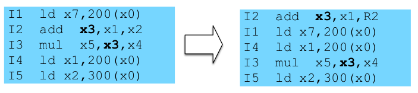

Mediante esto se logra retrasar la ejecución de la instrucción dependiente un
número **K** de etapas hasta que desaparezca el problema.

Se debe encontrar **K** instrucciones que se pueden ejecutar después de la instrucción que genera la dependencia sin variar la estructura lógica del programa.

Cuando no se pueden reordenar las instrucciones sin alterar la lógica del programa, entonces se deben insertar instrucciones **NOP**.

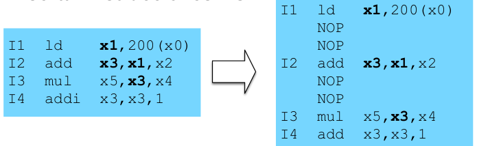
)

> La prevención no requiere de hardware adicional pero a expensas de un compilador más complejo y una pérdida de tiempo si es necesario insertar instrucciones `NOP`.

### RAW: solución hardware, detener el pipeline

Hardware adicional para detener la actividad en las etapas necesarias del pipeline hasta que desaparezca la dependencia.

Primero se detecta la dependencia y después se detiene el pipeline a partir de la instrucción dependiente hasta que desaparece la dependencia.

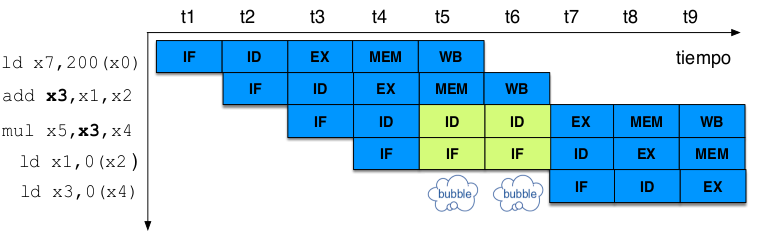

### RAW: solución hardware, adelantamiento

Técnica hardware de adelantamiento (data
forwarding):
- Pasar el resultado obtenido en una instrucción a las instrucciones que lo necesitan como operando.
- Las instrucciones los reciben en cuanto está disponible. 

Fácil de implementar, aunque no siempre se
puede aplicar.

Se debe identificar todos los posibles adelantamientos necesarios para el repertorio en cuestión.

Para ello hay adelantar el dato cuando esté disponible, es decir no esperar hasta que sea almacenado en un registro. Para ello se necesitan conexiones extra en la ruta de datos.

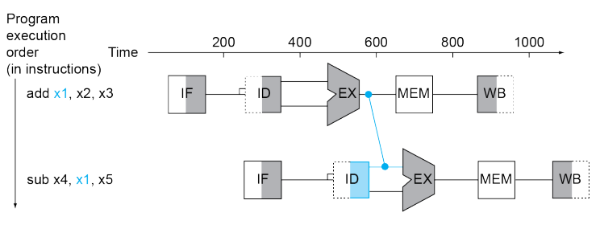

No siempre se pueden evitar las detenciones, incluso usando adelantamiento, por ejemplo:

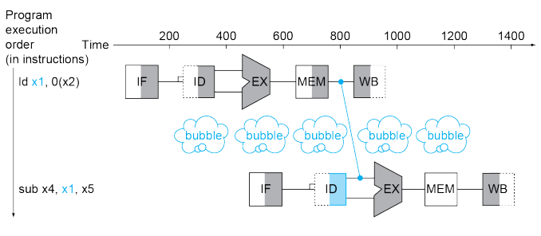


**Seguimos en la clase que viene...**


