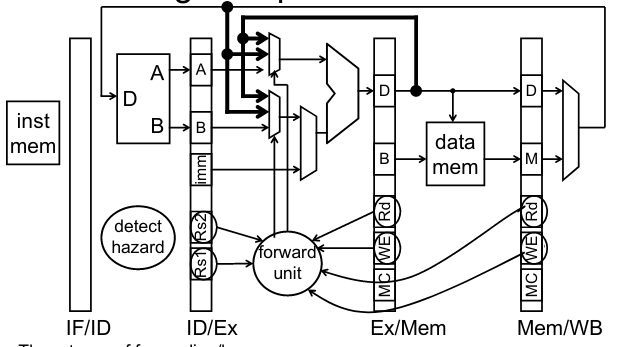

# Segmentación

# Riesgos

*(Recordemos)*

## Riesgos de datos

Dos o más instrucciones presentan dependencias de datos entre sí que podrían llevar a la obtención de resultados erróneos debido a una alteración en la secuencia de instrucciones.

Los tipos de dependencias son:
- **RAW**: Read After Write (representa un riesgo real).
- **WAR**: Write After Read.
- **WAW**: Write After Write.


> En castellano:
> - Lectura después de escritura (LDE) 
> - Escritura después de lectura (EDL)
> - Escritura después de escritura (EDE)

Veamos un ejemplo:

```
add  x19, x0, x1
sub  x2, x19, x3
```

Se almacena el resultado en el registro en WB.

Se leen los registros durante ID. 

Problema: la instrucción depende del resultado de la instrucción anterior.

Si hacemos stalling:


Las etapas de stalling en si son instrucciones NOP, donde las etapas del pipeline afectadas no hacen "nada".

 Se reduce el rendimiento, pero se requiere hacer esto para obtener resultados correctos.

El compilador puede organizar el código para evitar peligros y bloqueos (stalls). Requiere conocimiento de la estructura del pipeline.

Si hacemos adelantamiento (forwaring):

Busca usar el resultado cuando se calcula:
- No espera a que se almacene en un registro.
- Requiere conexiones adicionales en la ruta de datos. 


Se debe comparar el destino de las instrucciones más antiguas en el pipeline con las fuentes de la nueva instrucción en la etapa de decodificación. 

> ¡Debe ignorar las escrituras en x0!

Tres tipos de adelantamiento o reenvío:
- Reenvío desde registros EX/MEM a la etapa EX 
- Reenvío desde registro MEM/WB a la etapa EX
- Derivación al banco de registro

Como se implementa:



## Caso de EX/MEM a EX:


Problema: EX necesita un resultado de la ALU que está en la etapa MEM.

Solución: agregar un bypass de EX/MEM al inicio de EX.

Lógica de detección:

```
forward = 
(
 EX/MEM.WE && EX/MEM.Rd != 0 && 
 (ID/EX.Rs1 == EX/MEM.Rd || 
  ID/EX.Rs2 == EX/MEM.Rd)
)
```

## Caso de MEM/WB a EX:


Problema: EX necesita que WB escriba un valor.

Solución: agregar un bypass del valor final de WB al inicio de EX.

Lógica de detección:

```
forward = 
(MEM/WB.WE && MEM/WB.Rd != 0 &&
ID/EX.Rs1 == MEM/WB.Rd &&
not (EX/MEM.WE && EX/MEM.Rd != 0 &&
    ID/EX.Rs1 == EX/MEM.Rd) || 
(Igual para Rs2)
)
```

## Bypass del banco de registro


Problema: Leer un valor que se está escribiendo actualmente

Solución: simplemente negar el reloj del archivo de registro.
- las escrituras ocurren al final de la primera mitad de cada ciclo de reloj.
- las lecturas ocurren durante la segunda mitad de cada ciclo de reloj. 

Veamos ahora el caso de una instrucción Load:


Dependencia de datos después de una instrucción de carga: El valor no está disponible hasta después de la etapa MEM. La siguiente instrucción no puede continuar si es dependiente.

Veamos una secuencia:


Para esto se debe:


```
Stall =
(ID/Ex.MemRead && IF/ID.Rs1 == ID/Ex.Rd) ||
(ID/Ex.MemRead && IF/ID.Rs2 == ID/Ex.Rd)
```

Resolución de riesgos relacionados con load:

Solución RISC-V: stall (parada).

Debe insertarse la parada para que la instrucción de carga pueda pasar y actualizar el banco de registro.

El reenvío desde la RAM no es una opción.

En algunos casos, los compiladores del mundo real pueden optimizarse para evitar estas situaciones.

## Resumen

Los peligros de los datos ocurren cuando un operando (registro) depende del resultado de una instrucción anterior que puede que aún no se haya calculado.

Un procesador en pipeline necesita detectar los peligros de los datos.

Stall: evita que una instrucción dependiente avance, es una forma de resolver los peligros de los datos.

Esto introduce a las instrucciones NOP ("burbujas") en un pipeline. 

SE Introduce NOP:
1. evitando que la PC se actualice, .
2. evitando que cambien las escrituras en los registros IF/ID y (3) 
3. impidiendo las escrituras en la memoria y el banco de registro.

Las burbujas (nops) en el pipeline reducen significativamente el rendimiento.

El reenvío o adelantamiento reenvía un resultado a un operando de instrucción dependiente (registro). Mejor rendimiento que stall.

Ejercicio:

Busquen los riesgos e indique como los resuelve:

```
add  x3, x1, x2
and  x5, x3, x4
add  x2, x6, x3
lw   x6, 24 (x3)
sw   x6, 12 (x2)
```

## Peligros de control 

Una instrucción que modifica el valor del
PC todavía no lo ha hecho cuando se
tiene que comenzar la ejecución de la
siguiente instrucción.

BEQ, hasta la fase MEM no carga el valor
adecuado para el PC!.

El siguiente PC no se conoce hasta 2 ciclos después del branch (salto condicional) o jump (salto incondicional). 

¿Salto condicional no se cumple? ¡No hay problema! 

¿Salto condicional se cumple? Se han tomado 2 instrucciones, se deben eliminar y limpiarlas del pipeline.


Soluciones hardware
- Hardware adicional: Adelantamiento para control.
- Predicción de salto estática.

### Adelantamiento

En la etapa D debemos incluir el hardware necesario para:
- Evaluar la condición de salto (restador, Zero?).
- Calcular la dirección destino del salto (sumador).

Seguimos teniendo que hacer una parada:
- Las instrucciones de salto constituyen, aproximadamente, el 20% de las instrucciones ejecutas.
- Estas paradas empeoran el rendimiento


El adelantamiento resuelve 2 de los 3 paradas por stall.

Ante una instrucción de salto condicional la
predicción de salto estática decide
- Si es de salto tomado: ejecutar la instrucción destino de salto.
- Si es de salto no tomado, nunca saltamos, por lo que ejecutamos la siguiente instrucción, PC+4.
  
Si se falla en la prediccición, se vacía el pipeline y se ejecuta la instrucción correcta.

En nuestro caso sólo tiene sentido aplicar la
predicción de salto estática de salto no
tomado.


