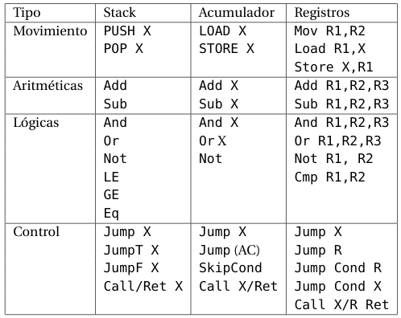

# Características de ISAs (Repaso)


**Arquitectura Stack**: las instrucciones y operandos son tomados implícitamente del stack o pila. 

> No se puede acceder a cualquier elemento del stack, sino que se debe seguir un orden. **No permite el acceso aleatorio**.

**Arquitectura acumulador**: en cualquier operación binaria un operando está implícito *(se lo suele llamar acumulador)* El otro operando suele ser la memoria, generando cierto tráfico en el bus.

**Arquitectura con registros de propósito general (GPR)**: los registros pueden ser utilizados en lugar de la memoria. Es más rápido que la de acumulador, se logran implementaciones eficientes usando compiladores, las instrucciones más largas *(dos o tres operandos)*.

Veamos un ejemplo de posibles instrucciones en cada arquitectura: 



> Donde X es una posición de memoria y Rx es un registro.

Las **Stack Machines** no usan operandos en las instrucciones, salvo **PUSH X** y **POP X** que requieren una dirección de memoria como operando. El resto de los operandos se obtienen del stack, por ejemplo: **PUSH** y **POP** operan sólo con el tope del stack.Las operaciones binarias (ej.**ADD**, **MULT**) usan los dos primeros elementos del stack.

Utilizan notación polaca inversa, por ejemplo: 

```
Z = X Y +
```

> Equivale a Z = X + Y

Es interesante que no se necesitan paréntesis:

```
Z = X Y * W U * +
```

> Equivale a Z = (X * Y) + (W * U)

## Comparativa

Veamos como se puede hacer una asignación en los distintos tipos de arquitecturas:

Tomemos en cuenta la siguiente instrucción: **Z = X * Y**, donde Z, X e Y son posiciones de memoria.

- Stack:
  
    ```
    push X
    push Y
    mult
    pop Z
    ```

- Acumulador: 
  
    ```
    load X
    mult Y
    store Z
    ```

- RPG *(Formato registro-memoria, usando 2 operandos)*

    ```
    load R1, X
    mult R1, Y
    store Z, R1
    ```
- RPG *(Formato registro-registro, usando 3 operandos)*

    ```
    load R1, X
    load R2, Y
    mult R3, R1, r2
    store Z, R3
    ```

- En una arquitectura memoria-memoria:

    ```
    mult Z, X, Y
    ```

## Tarea

Como pueden implementar: **Z = X * Y + W * U**

> Lean el material complementario.
