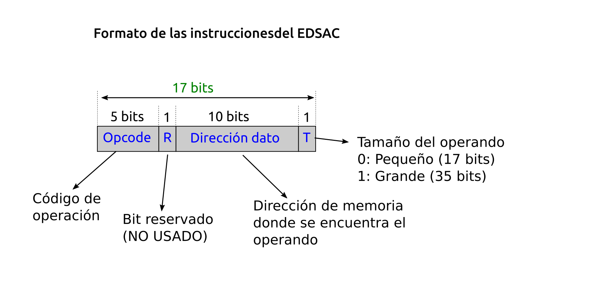

# Tareas clase 6

## Set de instrucciones

1. El formato de las instrucción del computador EDSAC (1949) es el siguiente:



- ¿Cuantas instrucciones como máximo se pueden tener en esta arquitectura?

- ¿Cual es el tamaño máximo de la memoria del EDSAC (en palabras)? Supongan que todos los datos son palabras de 17 bits

- En la posición de memoria 921 se encuentra la variable var1, que tiene el valor 30 (de 17 bits). El código de operación de la instrucción de suma es el 11100 en binario, que suma al registro acumulador el contenido de la variable de memoria indicada: A = A + variable, donde A es el acumulador del EDSAC. Escriban la instrucción en código máquina que hace la operación: A = A + var1

2. Considere un hipotético computador con un ancho de palabra de 20 bits con 60 registros que direcciona
la memoria por bytes. Responda a las siguientes preguntas:
- ¿Cuántos bits se emplean para las direcciones de memoria?
- ¿Cuál es el tamaño de los registros?
- ¿Cuántos bits se almacenan en cada posición de memoria?
- ¿Cuántas posiciones de memoria se pueden direccionar? Exprese el resultado en KB.
- ¿Cuántos bits se necesitan para identificar a los registros?

3. Considere un procesador de 32 bits. El banco de registros incluye 32 registros. El procesador es capaz de ejecutar 240 instrucciones máquina. Dada la siguiente instrucción hipotética: `addr R1, R2, (R3)`, donde R1, R2 y R3 representan registros y
(R3) representa direccionamiento indirecto de registro. Indique un posible formato para la instrucción.

4. Dadas las siguientes instrucciones:

- `PUT R1, R2` :Esta instrucción inserta dos palabras en la cima de la pila, primero el contenido del registro R1 y encima el contenido del registro R2
- `ADD`: Esta instrucción extrae de la pila el contenido de las dos primeras palabras apiladas. Realiza la suma de estos dos valores e inserta el resultado en la cima de la pila.
- `POP R1`:  Esta función extrae un elemento (palabra de la pila) y lo almacena en R1.

Defina el formato de las instrucciones si el banco de registros es de 32 registros, se dispone de 110 instrucciones y el computador es de 32 bits.


## Rendimiento

Veamos un ejemplo de Speedup:

El tiempo que tarda en ejecutarse un programa en A es 10 seg. y 15 seg. en B.

```
Tiempo de ejecución B / Tiempo de ejecución A = 15 seg. / 10 seg. = 1.5
```

**Entonces, A es 1.5 veces más rápido que B**.

Ahora, pasemos a los ejercicios:

1. Consideremos que la formula de rendimiento (Rx) es:

```
Rx = 1 / Tcpu
```

- Si tenemos dos ordenadores A y B que ejecutan el mismo programa. El ordenador A tarda 1 segundo en ejecutarlo, mientras que el ordenador B tarda 2 segundos. ¿Qué ordenador tiene mejor rendimiento?

2. El rendimiento relativo viene dado por:

```
Rendimiento relativo = Rx / Ry
```

- Podemos definir que computador es más rápido, situaremos la máquina con mejor rendimiento en el numerador y la máquina con menor rendimiento en el denominador para que el resultado sea mayor o igual a 1. Deben calcular el rendimiento relativo del ejercicio 1, y decir cuántas veces es más rápida una máquina con respecto a la otra.

3. Dado que el rendimiento es  la inversa del tiempo de CPU, la ecuacion 2 del rendimiento relativo se puede escribir también en función del tiempo de CPU de las máquinas que se están comparando:

```
Rx / Ry = Tcpu.y / Tcpu.x = Rendimiento relativo
```

- Si el computador A ejecuta un programa en 10 segundos y el computador B ejecuta el mismo programa en 15 segundos, ¿cuanto más rápido es A que B? Deben Determinarlo aplicando la formula precedente.

4.  Al ejecutarse un programa, tardará un número determinado de ciclos de reloj. Multiplicando el número de ciclos por el periodo del reloj obtenemos el tiempo de CPU de ese programa. Como la frecuencia es la inversa del periodo, también podemos obtenerla diviendo el tiempo de CPU entre la frecuencia del reloj:

```
Tcpu = Ciclos * Tclk = Ciclos / Fclk
```

- Un procesador funciona a la frecuencia de 1Ghz. Se ejecuta un programa que tarda 30 ciclos de reloj. ¿Cuanto tiempo tarda el programa en ejecutarse?

- El mismo programa anterior se ejecuta en un computador similar pero que tiene una frecuencia de reloj 1.2 Ghz. El programa sigue tardando 30 ciclos de reloj. ¿Cuanto tiempo tarda en ejecutarse ahora?

5. Por lo general no conocemos el número total de ciclos de reloj que tarda un programa en ejecutarse. Lo que sí sabemos son las instrucciones del programa. Y cada instrucción tarda un número de ciclos de reloj, determinado por la implementación del procesador. El número total de ciclos que tarda un programa en ejecutarse se puede calcular multiplicando el número de instrucciones por el número medio de ciclos por instrucción (CPI). Unas instrucciones requieren más ciclos que otras, por eso se usa su valor medio.

```
Ciclos = nro. de instrucciones * CPI (promedio)
```

- Tenemos dos implementaciones del mismo juego de instrucciones. El ordenador A tiene un periodo de reloj de 250 ps y un CPI de 2.0 para un determinado programa. El ordenador B tiene un periodo de reloj de 500 ps y un CPI de 1.2 para ese mismo programa. ¿Qué ordenador ejecuta más rápido ese programa y por cuanto? 

> usen las fórmulas de 4 y 5. Luego para saber que procesador es más de rápido usen la fórmula 3 (rendimiento relativo).

1. Esta fórmula es importante porque muestras los tres factores clave que afectan al rendimiento: El número de instrucciones, el número de ciclos por instrucción y el reloj del sistema.


```
Tcpu = nro. de instrucciones * CPI * Tclk
Tcpu = nro de instrucciones * CPI / Fclk
```

- Un diseñador de compiladores tiene que decidir entre dos secuencias de código para un computador. El diseñador hardware le ha suministrado los datos sobre el CPI de cada uno de los tipos de instrucciones de ese computador, clasificados en tres grupos: A, B y C

    | |	A |	B | C |
    |:----:|:----:|:----:|:----:|
    | CPI | 1 | 	2  |	3 |


- Hay dos secuencias de código, cada uno con su número de instrucciones de cada tipo

    | Secuencia de código  |	Tipo A |	Tipo B |	Tipo C |
    |:----:|:----:|:----:|:----:|
    |1 |	2 |	1 |	2 |
    |2 |	4 |	1 |	1 |

- Respondan:
  - ¿Qué secuencia de código tiene más instrucciones?
  - ¿Qué secuencia de código se ejecuta más rápido?
  - ¿Cual es el CPI de cada secuencia?

